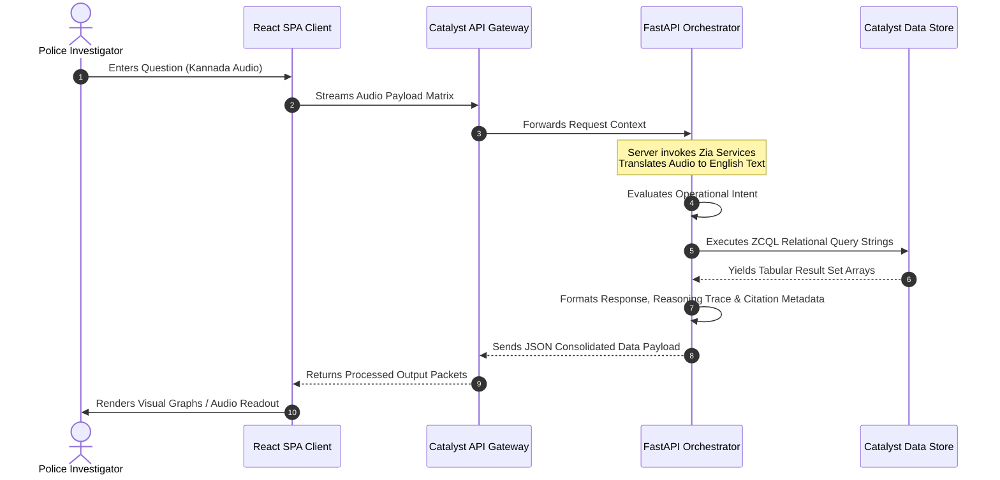
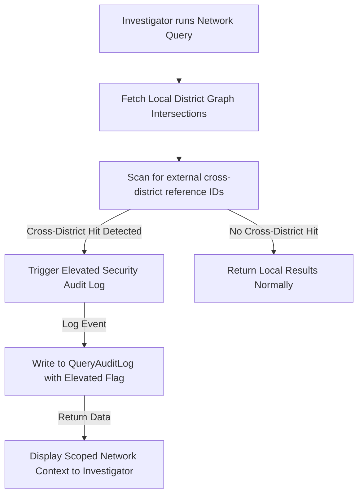
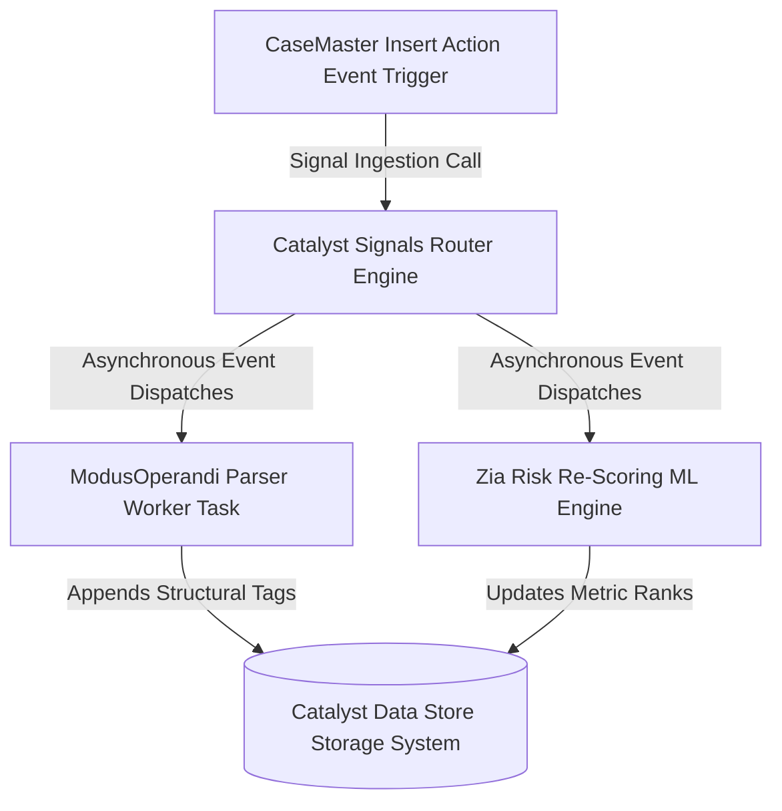

# Enterprise Architecture Blueprint: TriNetra (Revised)

### Intelligent Conversational AI & Crime Analytics Platform (Karnataka Police FIR System)

---

## 1. High-Level System Architecture

**TriNetra** utilizes a decoupled **Micro-kernel / Orchestration Router Model** deployed completely within the **Zoho Catalyst** infrastructure boundary. The system reads from a replica of the core 26-table Karnataka Police FIR schema, enriches it with 9 additive analytics tables, and provides a multi-engine processing architecture. This approach separates transactional retrieval, vector-based semantic search, relationship tracing, and machine learning pipelines to maintain sub-second latency across analytical workloads.

```mermaid
graph TD
    User([Police Personnel / Investigator]) -->|HTTPS / WSS| AGW[Catalyst API Gateway]
    AGW -->|Protected Route| AppSail[Catalyst AppSail: FastAPI Engine]
    
    subgraph Core Orchestration [Catalyst AppSail Runtime]
        Router[Central Intent Router]
        Ctx[Context & Session Manager]
        AuthZ[RBAC Context Validator]
        GraphEng[In-Memory Relational Graph Engine]
        SHAPEng[Custom SHAP Explanation Module]
        
        Router --> Ctx
        Router --> AuthZ
        Router --> GraphEng
        Router --> SHAPEng
    end
    
    subgraph Intelligence Tier [Managed Serverless Ecosystem]
        QML[Catalyst QuickML: RAG & LLM Engine]
        ZiaAuto[Catalyst Zia AutoML: Tabular ML Engine]
        ZiaSVC[Catalyst Zia Services: Voice & Translation]
        SmartB[Catalyst SmartBrowz: Headless PDF Engine]
    end
    
    subgraph Storage Tier [Relational & Vector Fabrics]
        DataStore[(Catalyst Data Store: 35 Relational Tables)]
    end

    AppSail -->|Orchestration Calls| Intelligence Tier
    AppSail -->|ZCQL Queries| Storage Tier

```

---

## 2. Overall Project Structure

The codebase is organized as a clean-architecture monorepo, separating the React front end from the FastAPI back end to allow independent compilation and deployment mapping via the Catalyst CLI.

```text
TriNetra/
├── .catalyst/                # Local CLI deployment state metadata
├── .gitignore                # Global workspace ignore rules
├── catalyst.json             # Root Catalyst configuration manifest linking components
├── .catalystrc               # Active project context pointers
├── trinetra-client/          # Frontend Web Application (React.js + TypeScript)
│   ├── src/
│   │   ├── components/       # Chat Shell, Reasoning Trace Panel, Graph Visualizer, Hotspot Map
│   │   ├── hooks/            # Session persistence and query handlers
│   │   ├── services/         # API abstraction layer wrapping Axios calls to Gateway
│   │   └── App.tsx           # UI Client Entry Point
│   ├── package.json
│   └── vite.config.ts        # Vite build pipelines
└── trinetra-backend/         # Backend Application (FastAPI Engine)
    ├── data/                 # Seed configuration data and lookup structures
    ├── engines/
    │   ├── router.py         # Intent classification logic (Factual, Graph, RAG, Analytics)
    │   ├── graph.py          # Relational Graph Engine (Scoped 2-hop traversals)
    │   ├── analytics.py      # Offender Risk Engine & custom SHAP extraction pipelines
    │   └── rag.py            # QuickML vector search interface wrappers
    ├── app.py                # Main application entry point optimized for AppSail runtime
    ├── requirements.txt      # Python dependencies manifest
    └── app-config.json       # Catalyst deployment descriptor (bound to python_3_11)

```

---

## 3. Frontend Architecture

The user interface is designed as an asynchronous, event-driven Single Page Application (SPA) utilizing an atomic component hierarchy. It coordinates rendering layers, state hooks, and asynchronous client connections.

```text
[Viewport View: Browser DOM / Canvas]
                 │
                 ▼
  [Visualization Tier: React Flow / Leaflet.js / Tailwind CSS]
                 │
                 ▼
  [Application Context: Conversation State / Audio Queues / Reasoning Trace]
                 │
                 ▼
  [Data Infrastructure: Axios Client / WebSocket Brokers]

```

### Key Components & State Scoping

* **Conversational Shell UI:** Houses the streaming text text panel and provides toggle triggers for the real-time voice pipeline.
* **Reasoning Trace Panel:** A UI panel that visualizes the sub-queries dispatched by the backend's Intent Router. It shows which specific engines (NL2SQL, Graph, RAG) were executed to construct the final composite answer.
* **Network Graph Canvas:** Uses **React Flow** to render node-edge arrays into interactive, styleable criminal association maps.
* **Spatial Hotspot Canvas:** Uses **Leaflet.js** to paint interactive density heatmaps over district coordinates.

---

## 4. Backend Architecture

The backend application functions as an intent-driven processing router built over the asynchronous FastAPI framework.

```text
[Catalyst Ingress Gateway Proxy]
                 │
                 ▼
     [Central Intent Router]
                 │
    ┌────────────┼────────────┐
    ▼            ▼            ▼
[Graph engine] [QuickML RAG] [Zia AutoML + SHAP]
    │            │            │
    └────────────┼────────────┘
                 │
                 ▼
    [Response Synthesizer & Citer]

```

* **Central Intent Router:** Scans the incoming string token using semantic keyword maps to categorize the request into factual lookups, network analysis, predictive trends, or narrative RAG searches.
* **Data Aggregation Layer:** Compiles data from the storage arrays using non-blocking asynchronous calls to prevent thread blocks during high-volume calculations.

---

## 5. Database Architecture & ER Relationships

The database layer consists of the 26 legacy Karnataka Police FIR tables (kept read-only to preserve production compatibility) and 9 additive analytics tables to power the intelligent capability metrics.

### Platform Data Types Optimization Table

Because **Catalyst Data Store** enforces specific structural limits (such as no native `JSONB` or `vector` data types, and forcing an alphanumeric string `ROWID` as the default primary key), the following configurations are implemented to maintain schema performance:

| Table Name | Column Name | App Data Type | Catalyst Data Type | Architectural Purpose & Trade-off Mitigation |
| --- | --- | --- | --- | --- |
| `OffenderRiskScore` | `TopFactors` | Deserialized JSON | **Text** | Catalyst lacks native JSONB. Stored as a flat string. To make it queryable for macro filtering, the FastAPI engine runs a text-search sub-query or processes the payload array in app memory during runtime. |
| All Tables | `ROWID` | String Hash | **Alphanumeric** | Catalyst mandates unique string hash IDs for its native Primary Keys. To optimize index performance during deep joins, explicit integer index keys (e.g., `CaseMasterID`, `AccusedMasterID`) are kept as standard indexed integer columns. |
| `ModusOperandi` | `Confidence` | float | **Double** | Holds values between $0.000$ and $1.000$ for probability indexing. |
| `CaseMaster` | `latitude` / `longitude` | float | **Double** | Retains full floating-point coordinate precision for Leaflet hotspot maps. |

---

## 6. AI/ML Architecture (NL2SQL, RAG, Analytics, Voice)

The core analytical pipeline utilizes a hybrid intelligence fabric distributed between native Catalyst cognitive tools and custom back-end scripting libraries.

### 6.1 Explainable Offender Risk Engine ($SHAP$ Formula Integration)

Because **Catalyst Zia AutoML** outputs clean classification probabilities but does not expose feature-level Shapley contributions out-of-the-box, the FastAPI back end features a custom calculation wrapper.

When a risk evaluation runs, the engine calculates feature attribution weights using a generalized additive approach:


$$g(z') = \phi_0 + \sum_{i=1}^{M} \phi_i z'_i$$


Where $\phi_0$ is the baseline base rate model prediction score, and $\phi_i \in \mathbb{R}$ represents the computed feature importance weight contribution assigned to specific historical record properties $i$ (e.g., prior arrest frequencies, weapon classification indices). This array is packed into the `TopFactors` column to fulfill the platform's explainability requirements.

### 6.2 Crime Forecasting & Alerting Logic (Pillar 8)

* **Methodology:** The analytics engine processes aggregated data from the `CrimeHotspotCell` table using an autoregressive forecasting framework (SARIMA/Prophet style).
* **Threshold Trigger Logic:** When a forecasted crime volume metric crosses a defined standard deviation boundary ($\mu + 2\sigma$) for a specific district and time window, the system throws a structural alert payload.
* **Early Warning Broadcast:** These payloads generate critical notification markers visible on the supervisor dashboard framework, enabling tactical deployment before seasonal crime surges occur.

### 6.3 Multilingual Speech & Translation Pipeline

* **Ingestion:** Incoming Kannada audio queries stream directly via WebSocket buffers to **Catalyst Zia Services**.
* **Translation-First Route:** Zia converts the Kannada audio payload into clean English text. This step eliminates parsing errors inside downstream SQL and graph generators built on English keywords.
* **Output Synthesis:** The finalized response text maps back through Zia to construct native Kannada text/speech arrays for the investigator user.

---

## 7. Component Architecture

```mermaid
component-diagram
    component [Web App Shell Client] as UI
    component [Gateway Controller] as GW
    component [Intent Router Component] as IR
    component [Network Structural Crawler] as NC
    component [Predictive Analytics Processor] as PAP
    component [Knowledge Base Core Manager] as KBM
    component [Reasoning Trace Module] as RTM

    UI --> GW : Dispatches Action Events
    GW --> IR : Routes Safe Request Payload
    IR --> NC : Calls Network Traversals
    IR --> PAP : Triggers Scoring Pipelines
    IR --> KBM : Invokes Vector Index Search
    IR --> RTM : Populates Execution Paths

```

---

## 8. Module Architecture

The FastAPI core application package separates operational responsibilities into isolated, maintainable units:

* **`ContextBroker`:** Monitors active conversation tokens across multi-turn chat loops, matching follow-up context queries (e.g., *"Show me his bank statements"*) to the correct historical suspect ID.
* **`ZCQLBuilder`:** Dynamically compiles secure, read-only SQL dialects optimized for fast data extraction inside the Catalyst Data Store workspace.
* **`SanitizationGuard`:** Reviews input fields before compilation to eliminate code injection vulnerabilities.

---

## 9. API Architecture & Response Schema Extensions

All communication vectors accept and return standard JSON payloads wrapped with strict validation criteria.

### Unified Endpoint Catalog

```text
POST /api/chat
  Description: Submits an active prompt string to the Intent Router.
  Request Body: { "query": "string", "session_token": "uuid" }
  Response Body: { 
    "intent": "factual_lookup", 
    "answer": "string", 
    "citations": ["CaseMasterID: 24021"],
    "reasoning_trace": {
      "execution_steps": [
        {"step": 1, "engine": "IntentRouter", "status": "Classified query as Factual + Network"},
        {"step": 2, "engine": "ZCQLBuilder", "status": "Executed query on CaseMaster table"},
        {"step": 3, "engine": "GraphEngine", "status": "Traversed 2-hop network for AccusedID A-491"}
      ],
      "processing_time_ms": 342
    }
  }

GET /api/network/{accused_id}
  Description: Returns node-edge arrays for relationship mapping visualization interfaces.
  Response Body: { 
    "nodes": [{"id": "str", "label": "str", "group": "person"}], 
    "edges": [{"source": "str", "target": "str", "weight": 2}] 
  }

POST /api/analytics/hotspot
  Description: Pulls geographical coordinate datasets filtered by district boundaries.
  Request Body: { "district_id": 102, "window": "2026-H1" }
  Response Body: { "cells": [{"lat": 12.97, "lng": 77.59, "weight": 85, "alert_level": "CRITICAL"}] }

```

---

## 10. Data Flow Architecture

System telemetry tracks specific execution paths optimized for streaming responses:

```text
[Data Source Ingestion Node] ──> [Signals Activation Engine] ──> [Asynchronous Worker Task]
                                                                            │
                                                                            ▼
[Analytics Aggregators] <── [Catalyst Data Store Framework] <─── [Additive Table Population]

```

When an incident update processes:

1. The primary transactional insert statement fires a **Catalyst Signal** notification event.
2. An asynchronous background worker intercepts the message payload context.
3. The worker runs data transformation pipelines over the new incident fields.
4. The script writes updated metadata values back into the analytics extension database rows, refreshing connected monitoring metrics.

---

## 11. Request-Response Flow Diagram



---

## 12. Authentication & RBAC Architecture

The authorization tier defines specific security contexts for user classes managed via **Catalyst Authentication**.

### 12.1 Cross-District Graph Scoping Governance & Exception Escalation (Pillar 10)

To prevent the strict **Local District Relational Scope** from blinding field investigators to cross-district crime syndicates, the architecture implements an automated exception escalation workflow:



1. **Investigator Context:** By default, data visibility parameters restrict queries to the home district `UnitID` context.
2. **Cross-District Exception Trigger:** When a query encounters cross-district link variables (e.g., a shared bank account or matching Modus Operandi tag pointing to an out-of-district case), the system logs an elevation event.
3. **Audited Elevation:** The system dynamically executes a limited cross-district query, passes the network link data back to the user context, and registers an **Elevated Audit Token** inside the `QueryAuditLog` table. This token details the reasoning path for review by system administrators.

---

## 13. Security & Governance Architecture

* **Database Isolation Rules:** The AppSail database connection layer uses a strict read-replica configuration for the 26 primary transactional tables, protecting production data records from modification errors.
* **Privacy Guardrails:** Criminological cohort queries tracking protected demographic vectors (`CasteMaster`, `ReligionMaster`) clear their response arrays if the output row length is under 10 rows. This data-masking rule prevents individual identification profiles from leaking during micro-demographic sorting.
* **Immutable Transaction Logs:** The `QueryAuditLog` operates on an append-only configuration structure, preventing any alteration or deletion of tracking trails.

---

## 14. Deployment Architecture

Deployments compile directly to the **Zoho Catalyst** production infrastructure boundary environment, removing the manual configuration overhead of custom web servers and container platforms.

```mermaid
deployment-diagram
    deploymentNode [Zoho Catalyst Cloud Engine Boundary Workspace] {
        deploymentNode [Web Client Hosting Managed Node] {
            artifact [React Compiled SPA Static Content Package]
        }
        deploymentNode [AppSail Cluster Infrastructure Workspace] {
            artifact [FastAPI Production Core Server Implementation]
        }
        deploymentNode [Data Store Architecture Subsystem] {
            database [Relational Database Core Storage Engines]
        }
    }

```

---

## 15. Infrastructure Architecture

The platform offloads standard operations—such as system scaling, load balancing, reverse proxy routing, and cross-zone database replication—directly to the native cloud layer.

```text
[Incoming Public Gateway Requests]
                 │
                 ▼
  [Catalyst API Gateway Proxies]
                 │
                 ▼
  [Catalyst AppSail Runtime Workers]
                 │
    ┌────────────┴────────────┐
    ▼                         ▼
[Managed Cache Fabric] [Data Store Engines]

```

---

## 16. Background Jobs & Event-Driven Architecture

The analytics engine uses asynchronous background jobs to protect primary user interactive response pipelines from performance drag.



---

## 17. Phase 1 Graph Scoping Limitations & Evolution Strategy (Pillar 2)

### 17.1 Phase 1 (Hackathon MVP Scope)

To work around high-volume join latency limits in relational databases, the **In-Memory Graph Engine** inside FastAPI uses an explicit optimization constraint:

* **Hop-Depth Cap:** The engine enforces a strict **2-hop search ceiling** across `Accused ──> Shared CaseID ──> Co-Accused ──> SuspectAccount ──> FinancialTransactions`.
* This approach avoids slow, deep relational loops, ensuring fast JSON response formatting during the platform demonstration.

### 17.2 Phase 2 (Production Evolution)

For full enterprise deployment, the relationship tracing code will migrate from relational data store sub-queries to an external **Neo4j Aura Cloud instance** or a dedicated property graph cluster.

This update enables deep graph calculations, such as community detection (Louvain/Label Propagation algorithms for identifying organized crime gangs) and multi-hop shortest-path tracking, without hitting relational performance bottlenecks.

---

## 18. Complete Database ER Architecture (35-Table Schema Summary)

The database schema matches the original 26-table Karnataka Police FIR architecture, extended with 9 additive tracking and audit modules:

```mermaid
erDiagram
    State ||--o{ District : "contains"
    District ||--o{ Unit : "houses"
    UnitType ||--o{ Unit : "classifies"
    Rank ||--o{ Employee : "grades"
    Designation ||--o{ Employee : "assigns"
    
    Unit ||--o{ Employee : "employs"
    Employee ||--o{ CaseMaster : "registers"
    Unit ||--o{ CaseMaster : "jurisdiction_of"
    
    CaseCategory ||--o{ CaseMaster : "categorizes"
    GravityOffence ||--o{ CaseMaster : "weights"
    CrimeHead ||--o{ CrimeSubHead : "parents"
    CrimeHead ||--o{ CaseMaster : "classified_under"
    CrimeSubHead ||--o{ CaseMaster : "sub_classified_under"
    CaseStatusMaster ||--o{ CaseMaster : "tracks"
    Court ||--o{ CaseMaster : "adjudicates"

    CaseMaster ||--o{ ComplainantDetails : "reported_by"
    CaseMaster ||--o{ ActSectionAssociation : "violates"
    CaseMaster ||--o{ Victim : "harms"
    CaseMaster ||--o{ Accused : "charges"
    CaseMaster ||--o{ ArrestSurrender : "records"
    CaseMaster ||--o{ ChargesheetDetails : "resolves"
    
    Accused ||--o{ ArrestSurrender : "detains"
    
    %% Analytics Additions
    MOTagMaster ||--o{ ModusOperandi : "defines"
    CaseMaster ||--o{ ModusOperandi : "exhibits"
    Accused ||--o{ SuspectAccount : "owns"
    SuspectAccount ||--o{ FinancialTransaction : "transacts_from"
    CaseMaster ||--o{ FinancialTransaction : "linked_to"
    CaseMaster ||--o{ CaseStatusHistory : "logs_timeline"
    Accused ||--o| OffenderRiskScore : "scores"
    District ||--o{ CrimeHotspotCell : "monitors_trends"
    Employee ||--o{ QueryAuditLog : "signs"

    State {
        int StateID PK
        varchar StateName
    }
    District {
        int DistrictID PK
        varchar DistrictName
        int StateID FK
    }
    Unit {
        int UnitID PK
        varchar UnitName
        int DistrictID FK
    }
    Employee {
        int EmployeeID PK
        varchar KGID
        varchar FirstName
        int UnitID FK
    }
    CaseMaster {
        int CaseMasterID PK
        varchar CrimeNo UK
        text BriefFacts
        decimal latitude
        decimal longitude
    }
    Accused {
        int AccusedMasterID PK
        int CaseMasterID FK
        varchar AccusedName
    }
    SuspectAccount {
        int AccountID PK
        int AccusedMasterID FK
        varchar AccountNumber
    }
    FinancialTransaction {
        int TxnID PK
        int FromAccountID FK
        int ToAccountID FK
        decimal Amount
    }
    OffenderRiskScore {
        int AccusedMasterID PK_FK
        decimal RiskScore
        text TopFactors
    }
    CrimeHotspotCell {
        int CellID PK
        decimal GridLat
        decimal GridLng
        int DistrictID FK
        int CrimeCount
    }
    QueryAuditLog {
        int AuditID PK
        int EmployeeID FK
        text NLQueryText
        text ResolvedQuery
    }

```

### Table Inventory Checklist

1. **Master Domain References (17 Tables):** `State`, `District`, `UnitType`, `Rank`, `Designation`, `CasteMaster`, `ReligionMaster`, `OccupationMaster`, `CaseStatusMaster`, `CaseCategory`, `GravityOffence`, `CrimeHead`, `CrimeSubHead`, `Act`, `Section`, `CrimeHeadActSection`, `Court`.
2. **Core Transactional FIR Records (9 Tables):** `Unit`, `Employee`, `CaseMaster`, `ComplainantDetails`, `ActSectionAssociation`, `Victim`, `Accused`, `ArrestSurrender`, `ChargesheetDetails`.
3. **Intelligent Platform Extensions (9 Tables):** `MOTagMaster`, `ModusOperandi`, `SuspectAccount`, `FinancialTransaction`, `CaseStatusHistory`, `OffenderRiskScore`, `CrimeHotspotCell`, `QueryAuditLog`, `EntityAlias`.

---

## 19. Architecture Decisions Rationale & Trade-Off Matrix

| Selected Architectural Approach | Alternative Option Evaluated | Tactical Justification & Risk Mitigation |
| --- | --- | --- |
| **Multi-Engine Intent Orchestration Router** | Unified End-to-End LLM Wrapper Pattern | Generic LLM pipelines frequently hallucinate complex joins across normalized schemas. Selecting a routing kernel guarantees **absolute factual tracing** by passing query contexts to distinct, specialized computing modules. |
| **In-Memory Relational Graph Traverser (FastAPI Memory Joins)** | External Hosted Property Graph Cluster (Neo4j Aura Node) | External database endpoints add infrastructure overhead and setup complexity during a high-pressure hackathon. Enforcing a **strict 2-hop search ceiling** provides clean relationship tracking during the MVP phase while protecting operational response speeds. |
| **Translation-First Translation Pipeline Pattern** | Multi-Language Database Schema Execution Layout | Maintaining multiple query-parsing templates across regional dialects increases code maintenance costs. Converting input text to English normalizes operations, reducing parsing bugs across analytical models. |
| **Managed Serverless Cloud Workspace Environment** | Containerized Microservices Infrastructure Setup (Docker / Kubernetes Cluster) | Kubernetes clusters require complex manual configuration for load balancing and infrastructure scaling. Serverless provisioning automates these tasks, allowing development focus to remain entirely on **business logic engineering**. |