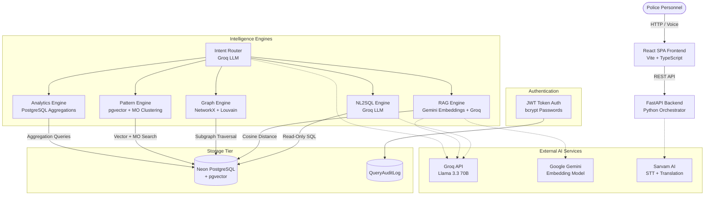
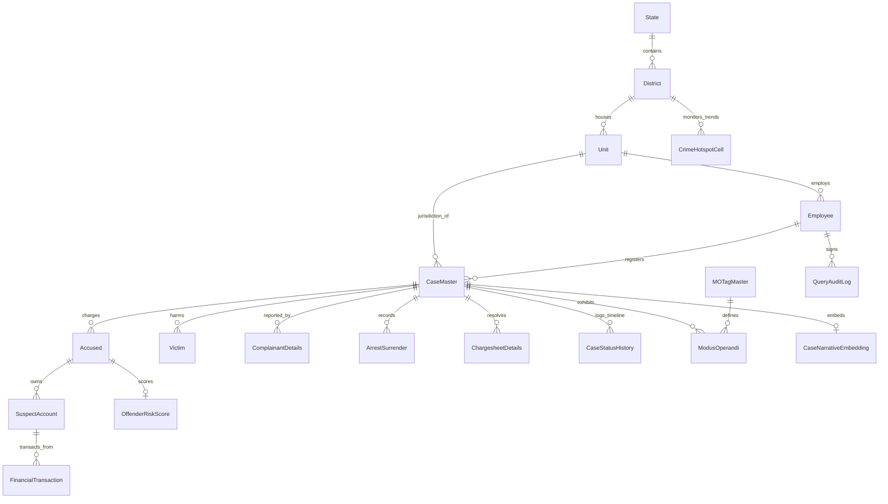
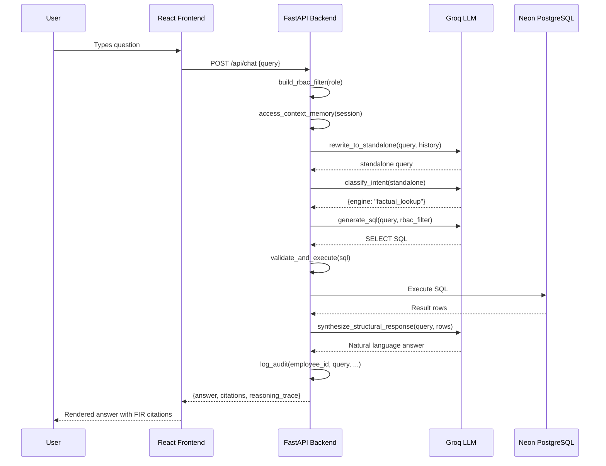
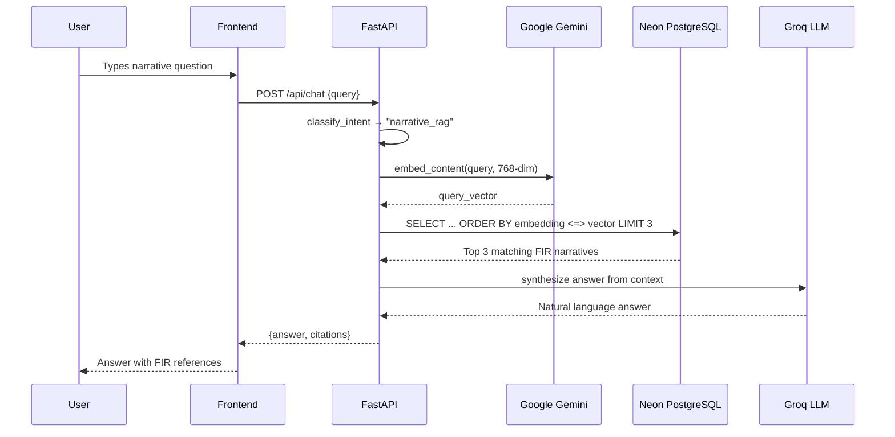

# TriNetra — Project Documentation

> **Intelligent Conversational AI & Crime Analytics Platform**
> Built for the Karnataka State Police FIR Database

---

## Table of Contents

1. [Project Overview](#1-project-overview)
2. [Problem Statement](#2-problem-statement)
3. [Solution](#3-solution)
4. [Architecture](#4-architecture)
5. [Repository Structure](#5-repository-structure)
6. [Technology Stack](#6-technology-stack)
7. [Complete Application Flow](#7-complete-application-flow)
8. [Pages and UI](#8-pages-and-ui)
9. [Features](#9-features)
10. [APIs](#10-apis)
11. [Database](#11-database)
12. [Authentication and Authorization](#12-authentication-and-authorization)
13. [External Services and Integrations](#13-external-services-and-integrations)
14. [AI / LLM Integration](#14-ai--llm-integration)
15. [Security](#15-security)
16. [Error Handling](#16-error-handling)
17. [Configuration and Environment Variables](#17-configuration-and-environment-variables)
18. [Deployment](#18-deployment)
19. [Testing](#19-testing)
20. [Important Algorithms and Business Logic](#20-important-algorithms-and-business-logic)
21. [Data Flow](#21-data-flow)
22. [Important User Journeys](#22-important-user-journeys)
23. [Implementation Details](#23-implementation-details)
24. [Design Decisions](#24-design-decisions)
25. [Current Implementation Status](#25-current-implementation-status)
26. [Known Limitations](#26-known-limitations)
27. [How to Run the Project](#27-how-to-run-the-project)
28. [Developer Guide](#28-developer-guide)
29. [Glossary](#29-glossary)
30. [Complete Feature/Page Matrix](#30-complete-featurepage-matrix)
31. [Complete Architecture Summary](#31-complete-architecture-summary)

---

## 1. Project Overview

**TriNetra** (meaning "Three Eyes") is an enterprise-grade conversational AI and crime analytics platform built on top of a Karnataka Police FIR (First Information Report) database. It empowers police investigators, crime analysts, supervisors, and policymakers to interact with crime records using natural language queries (English and Kannada, voice and text) while discovering hidden relationships, network structures, socio-demographic trends, and behavioral profiles.

| Attribute | Detail |
|---|---|
| **Project Name** | TriNetra — Intelligent Conversational AI & Crime Analytics Platform |
| **Primary Purpose** | Enable law enforcement personnel to query, analyze, and visualize crime data through natural language and multi-dimensional analytics |
| **Target Users** | Karnataka Police investigators, crime analysts, supervisors, and policymakers |
| **Core Dataset** | 2,896 synthetic FIR records across 31 Karnataka districts, 3,827 accused, 4,530 victims, 8 seeded criminal networks |
| **Developed By** | Yashvanth M U and Swamy B S (ISE Students, RV College of Engineering) |
| **Original Context** | Built as an entry for the "Intelligent Conversational AI for KSP Crime Database" challenge |

### Major Value Proposition

TriNetra goes beyond simple data retrieval. It implements a **multi-engine intent routing architecture** that classifies natural-language queries into distinct execution paths (NL2SQL, Graph Traversal, Vector RAG, Analytics) and dispatches each to a specialized computation engine — avoiding the hallucination and fragility of generic LLM wrappers while providing structural explainability through explicit row citations.

---

## 2. Problem Statement

Law enforcement agencies maintain vast relational databases of FIR records (cases, accused, victims, locations, chargesheets, arrests). However, interacting with these databases typically requires:

- Expert SQL knowledge
- Manual cross-referencing across normalized tables
- Manual graph analysis for network detection
- No multilingual support for regional-language-speaking officers
- No voice interaction capability
- No automated pattern detection or predictive alerts
- No explainability behind analytical conclusions

**Consequences:** Investigators miss connections between criminals across districts. Emerging crime patterns go undetected until they escalate. Officers waste hours on data retrieval rather than analysis. Cross-district criminal syndicates operate undetected.

---

## 3. Solution

TriNetra provides a **four-layer intelligent platform**:

1. **Conversational Layer** — A chat-based natural language interface (text + voice, English + Kannada) that accepts free-form questions and routes them to appropriate engines.

2. **Intelligence Layer** — Four specialized engines:
   - **NL2SQL Engine** — Converts natural language to PostgreSQL queries via Groq LLM
   - **Graph Engine** — Multi-layer criminal network analysis using NetworkX with 5 edge types
   - **RAG Engine** — Semantic vector search over FIR narratives using pgvector + Gemini embeddings
   - **Pattern Engine** — MO-based cluster detection and tri-signal case similarity scoring

3. **Data Layer** — Neon Serverless PostgreSQL with pgvector extension, combining 26 legacy FIR tables with 9 additive analytics tables.

4. **Governance Layer** — JWT-based authentication with rank-derived RBAC (Investigator/Supervisor/Analyst/Policymaker), immutable audit logging, and privacy threshold enforcement (n ≥ 10 for demographic queries).

---

## 4. Architecture

### High-Level Architecture



### Key Architectural Decisions

| Decision | Rationale |
|---|---|
| Multi-engine intent routing | Avoids generic LLM hallucination on complex SQL joins; dispatches to specialized engines |
| In-memory NetworkX graph (2-hop cap) | Fast MVP without external graph DB overhead; avoids deep relational join latency |
| Translation-first pipeline (Sarvam AI) | Normalizes Kannada audio to English text before LLM processing, reducing parse errors |
| pgvector in PostgreSQL | Avoids external vector DB dependency; leverages native SQL cosine similarity |
| Read-only SQL enforcement | 4-tier guardrails (SELECT only, no multi-statement, table whitelist, LIMIT 200) |

---

## 5. Repository Structure

### Top-Level Layout

```
/
├── README.md                         # High-level project overview (Zoho Catalyst era)
├── Architecture_Blueprint.md         # Detailed architecture blueprint with ER diagrams
├── Challenge_Details.txt             # Original challenge specification
├── Catalyst_Schema_CSVs/             # 33 CSV files (seed/reference data for all tables)
├── DataGeneration/                   # Database schema SQL, seed data, storyline docs
│   ├── DataBase_Schema.sql           # Complete PostgreSQL DDL (26 base + 9 analytics tables)
│   ├── karnataka_crime_data.sql      # INSERT statements for seeded dataset
│   ├── DATASET_README.md             # Dataset documentation and loading guide
│   └── storyline_summary.md          # Seeded gang clusters and repeat offender lookup tables
├── Documets/                         # Architecture diagram images (PNG)
└── TriNetra/                         # Main application monorepo
    ├── trinetra-backend/             # FastAPI Python backend
    │   ├── app.py                    # Main FastAPI application with all route definitions
    │   ├── engines/                  # Modular business logic
    │   ├── Testing/                  # Benchmark and security test suites
    │   ├── requirements.txt          # Python dependencies
    │   ├── .env                      # Environment variables (secrets)
    │   ├── passwordscript.py         # Utility to seed bcrypt passwords for all employees
    │   └── seed_vector_db.py         # Utility to generate Gemini embeddings and store in pgvector
    ├── trinetra-client/              # React + Vite frontend
    │   ├── src/
    │   │   ├── pages/                # 13 page components
    │   │   ├── components/           # Shared components (AppShell, NetworkGraph)
    │   │   ├── context/              # AuthContext for JWT state management
    │   │   ├── services/             # API abstraction layer (api.ts)
    │   │   ├── lib/                  # Utility functions (cn for Tailwind merge)
    │   │   └── App.tsx               # Route definitions
    │   ├── package.json
    │   └── vite.config.ts
    └── Architecture_diagram          # Architecture diagram image
```

### Backend Engine Modules

| Module | File | Purpose |
|---|---|---|
| Intent Router | `engines/router.py` | Classifies user queries into 6 engine categories via Groq LLM; rewrites follow-up queries to standalone |
| NL2SQL | `engines/nl2sql.py` | Generates PostgreSQL from natural language via Groq; 4-tier SQL validation; self-repair loop |
| RAG | `engines/rag.py` | Gemini embedding generation → pgvector cosine search → Groq answer synthesis |
| Graph | `engines/graph.py` | Builds NetworkX graph from co-accused + financial links; 2-hop neighborhood traversal |
| Network | `engines/network_engine.py` | Extended multi-layer graph (5 edge types); Louvain community detection; node detail panel |
| Analytics | `engines/analytics.py` | 11 analytics endpoints: summary, hotspots, trends, offenders, alerts, demographics, lifecycle, etc. |
| Case Explorer | `engines/case_explorer.py` | Paginated, filterable case search with full detail retrieval (no LLM dependency) |
| Pattern | `engines/pattern_engine.py` | MO-based emerging pattern detection; tri-signal case similarity (pgvector + MO + geo/time) |
| Sarvam | `engines/sarvam_engine.py` | Sarvam AI integration for Kannada/English STT and translation |
| Auth | `engines/auth.py` | bcrypt password verification, JWT token creation/verification, rank-to-role mapping |
| Security | `engines/security.py` | RBAC SQL filter generation; immutable audit log writing |
| Database | `engines/database.py` | Legacy CSV-based data engine (unused in production; superseded by PostgreSQL) |

---

## 6. Technology Stack

### Frontend

| Technology | Version | Purpose |
|---|---|---|
| React | 19.x | UI component framework |
| TypeScript | ~6.0 | Type-safe development |
| Vite | 8.x | Build tool and dev server |
| Tailwind CSS | 4.x | Utility-first styling |
| React Router | 7.x | Client-side routing |
| React Flow | 11.x | Interactive node-edge graph visualization |
| Recharts | 3.x | Statistical charts (area, bar, pie, line) |
| React-Leaflet | 5.x | Geospatial map rendering (Leaflet) |
| Lucide React | 1.x | Icon library |
| Axios | 1.x | HTTP client (imported but fetch is used directly) |
| clsx + tailwind-merge | — | Conditional className utility (`cn()`) |

### Backend

| Technology | Purpose |
|---|---|
| Python 3.11+ | Backend language |
| FastAPI | Asynchronous REST API framework |
| Uvicorn | ASGI server |
| psycopg2 | PostgreSQL database driver |
| pgvector | Vector similarity search extension |
| NetworkX | In-memory graph computation |
| python-louvain | Community detection algorithm |
| PyJWT | JWT token creation and verification |
| bcrypt | Password hashing |
| python-dotenv | Environment variable loading |
| Groq (groq SDK) | LLM API for intent classification, NL2SQL, text synthesis |
| Google GenAI | Embedding generation (gemini-embedding-001) |
| Sarvam AI | Speech-to-text and Kannada/English translation |

### Database

| Technology | Purpose |
|---|---|
| Neon Serverless PostgreSQL | Primary database (relational + vector) |
| pgvector extension | 768-dimensional cosine similarity search |

### External AI Services

| Service | Model | Purpose |
|---|---|---|
| Groq API | llama-3.3-70b-versatile | Intent classification, query rewriting, NL2SQL generation, answer synthesis |
| Google Gemini | gemini-embedding-001 | 768-dim embedding generation for FIR narrative vectors |
| Sarvam AI | saaras:v3 | Speech-to-text for Kannada/English audio |
| Sarvam AI | sarvam-translate:v1 | Kannada ↔ English neural translation |

---

## 7. Complete Application Flow

### Chat Query Flow (Core Intelligence Path)

```
1. User types a natural-language question in the Ask TriNetra chat interface
2. Frontend (AskTriNetra.tsx) calls sendChatQuery() in api.ts
3. If Kannada mode (KN): Frontend calls Sarvam AI /api/sarvam/translate to convert to English
4. Frontend sends POST /api/chat with {query, session_token, role, employee_id, unit_id, district_id}
5. Backend (app.py /handle_chat):
   a. SecurityContext.build_rbac_filter() generates SQL WHERE clause based on user's role
   b. access_context_memory() retrieves conversation history for the session
   c. IntentRouter.rewrite_to_standalone() rewrites follow-up questions using Groq LLM
   d. IntentRouter.classify_intent() classifies into one of 6 engines via Groq LLM
   e. Routes to appropriate engine:
      - factual_lookup / trend_analysis → NL2SQLEngine
      - narrative_rag → RAGEngine
      - criminal_network → GraphEngine
      - risk_profile → AnalyticsEngine
      - case_similarity → PatternEngine
   f. SecurityContext.log_audit() records the interaction to QueryAuditLog
6. Response returned: {status, intent_detected, answer, citations, graph_data, analytics_data, reasoning_trace}
7. If Kannada mode: Frontend calls Sarvam AI to translate answer back to Kannada
8. Frontend renders message with inline graph, charts, or citations as appropriate
```

### Login Flow

```
1. User enters Employee ID + password on LoginPage
2. Frontend calls POST /api/login with {employee_id, password}
3. Backend (auth.py /authenticate_employee):
   a. Queries EmployeeCredentials table for bcrypt hash
   b. Verifies password using bcrypt.checkpw()
   c. Fetches full employee profile with JOINs (District, Unit, Rank, Designation)
   d. Maps rank name to RBAC role (DGP→Policymaker, SP→Analyst, Inspector→Supervisor, default→Investigator)
4. Backend creates JWT token with employee_id, role, district_id, unit_id (24h expiry)
5. Frontend stores token + profile in localStorage; redirects to /dashboard
```

---

## 8. Pages and UI

### 8.1 Landing Page (`/`)
- **Purpose:** Public marketing page introducing TriNetra to visitors
- **Content:** Hero section, challenge description, four-layer architecture explanation, core capabilities showcase, developer credits, footer with links
- **Navigation:** "Log In to Portal" button → /login; "Architecture Diagram" button → full-screen ArchitecturePage overlay
- **Authentication:** None required

### 8.2 Login Page (`/login`)
- **Purpose:** Secure authentication for police personnel
- **Fields:** Employee ID (numeric), Password
- **Demo shortcuts:** Pre-filled buttons for Employee IDs 96, 275, 104 with password "1234"
- **Behavior:** Validates input → calls `/api/login` → stores JWT in localStorage → redirects to /dashboard
- **Error Handling:** Displays red error banner for invalid credentials, network errors

### 8.3 Dashboard (`/dashboard`)
- **Purpose:** High-level overview for the logged-in officer's jurisdiction
- **Key Data (fetched in parallel):**
  - Analytics summary (total cases, solved %, highest district, arrest rate, avg days to chargesheet)
  - Prevention alerts (count of active warnings for their district)
  - Crime trend chart (monthly case counts)
- **UI Components:**
  - "Ask TriNetra AI Copilot" hero card → links to /ask
  - 4 KPI stat cards (Total Crimes, Solved Rate, Active Alerts, District)
  - Recharts AreaChart showing crime trend over time
  - Prevention alerts list (top 3) with severity badges
- **Authentication:** Required (JWT)

### 8.4 Ask TriNetra (`/ask`)
- **Purpose:** Core conversational AI interface — the primary intelligence copilot
- **Input:** Free-text textarea + voice recording button (Sarvam AI STT)
- **Language Toggle:** Switches between English (EN) and Kannada (KN) mode
  - EN mode: Queries go directly to backend LLM
  - KN mode: Frontend translates query → English via Sarvam → sends to backend → translates answer back to Kannada
- **Response Types (inline rendering):**
  - **Text answers** with engine badge (factual_lookup, narrative_rag, etc.)
  - **Inline NetworkGraph** when criminal_network engine is triggered
  - **Inline AreaChart** when trend_analysis is triggered
  - **Inline RiskCard** with progress bar when risk_profile is triggered
  - **Citations** as clickable FIR reference badges
  - **Reasoning Trace** expandable panel showing execution steps
- **Export:** "Export Report" button generates styled HTML report via POST /api/chat/export
- **Example Prompts:** 8 pre-defined prompt buttons demonstrating different engine capabilities
- **Session Management:** In-memory session store with 30-minute TTL; conversation history for context rewriting

### 8.5 Case Explorer (`/cases`)
- **Purpose:** Manual deep-dive investigation into FIR records
- **Filter Bar:** District, Status, Category, Crime Head, Date Range, Free-text search
- **Results:** Paginated table with Date, Crime No, District, Status Badge (color-coded), Crime Head
- **Case Detail Drawer:** Slides in from right showing:
  - **Overview:** Brief facts, GPS coordinates, case metadata
  - **Timeline:** Status history trail
  - **People:** Accused, Victims, Complainants with demographics
  - **Chargesheets & Arrests:** Full chronological record
- **Deep-linking:** Accepts `?search=CrimeNo` URL parameter; clicking Accused ID redirects to Network Analysis
- **API:** Uses direct SQL endpoints (CaseExplorerEngine), not NL2SQL

### 8.6 Network Analysis (`/network`)
- **Purpose:** Visualize criminal syndicates, gangs, and financial networks
- **Search:** Autocomplete search for accused by name or ID (via `/api/network/search`)
- **Graph Visualization (React Flow):**
  - Nodes: Criminals, color-coded by Louvain community detection (gang affiliation)
  - Edges: 5 relation types with distinct colors and emojis
    - 🤝 Co-Accused (red)
    - 💰 Money Trail (green)
    - 👤 Same Person (violet)
    - 🎯 Same MO Pattern (amber)
    - ⚖️ Victim↔Accused (pink)
  - Force-directed layout with repulsion/attraction physics
  - Root node highlighted in gold
- **Controls:** Layer toggle (enable/disable each relation type), hop-depth selector (1-3), community coloring toggle
- **Node Detail Side Panel:** Click any node to see:
  - Personal info, linked cases, financial accounts, modus operandi tags
  - Risk score, neighbor list with edge details
- **Statistics:** Node count, edge count, community count, relation breakdown

### 8.7 Crime Analytics (`/analytics`)
- **Purpose:** Multi-dimensional macro-level analytics dashboard
- **Filter Bar:** District, Category, Time Window (3m/6m/12m/All Time)
- **KPI Strip:** 5 cards (Total Cases, MoM Change, Arrest Rate, Avg Days to Chargesheet, Highest Activity District)
- **Visualizations:**
  - **Statewide Hotspot Density** — React-Leaflet map with CircleMarker clusters
  - **District Rankings** — Scrollable list with inline sparkline charts
  - **YoY Category Comparison** — Recharts grouped BarChart
  - **Monthly Registration Trend** — Recharts AreaChart
  - **Crime Head Distribution** — Recharts PieChart (donut)
  - **Gravity Split** — Recharts PieChart
  - **Top Modus Operandi** — Recharts horizontal BarChart
  - **Case Lifecycle Status** — Recharts BarChart (status funnel)
  - **FIR Reporting Lag** — Recharts BarChart (incident-to-registration buckets)
  - **Victim Socio-Demographics** — Recharts stacked horizontal BarChart with n<10 privacy redaction

### 8.8 Pattern Analytics (`/pattern-analytics`)
- **Purpose:** Discover hidden crime clusters and find similar cases
- **Tab 1 — Emerging Patterns:**
  - Left panel: Feed of MO-based clusters with sparkline charts, case counts
  - Right panel: Map showing geographic spread + chronological case list
  - Auto-detected from ModusOperandi tag surges in the last 90 days
- **Tab 2 — Find Similar Cases:**
  - Search input for CaseMasterID
  - Results: Matched cases with composite score (0-100%), explainability badges
  - Signals: Narrative similarity, MO overlap, geo-proximity, temporal proximity

### 8.9 Offender Profiles (`/offenders`)
- **Purpose:** Browse and rank accused by recidivism risk score
- **Search:** Name or ID search
- **Table Columns:** Profile Name, Prior Case Count, Risk Score (color-coded), Repeat Offender Flag, Details expand
- **Expandable Row:** "TriNetra Explainable AI (XAI) Insight" with plain-English factor explanations:
  - Frequency Factor (prior case count contribution)
  - Severity Factor (heinous case count)
  - Recency & Recidivism Factor (days since last offense)
- **Sorting:** By name, prior count, risk score, repeat flag (asc/desc)
- **Pagination:** 15 profiles per page

### 8.10 Prevention Alerts (`/alerts`)
- **Purpose:** Proactive early warning system for the officer's jurisdiction
- **Alert Cards:** Auto-generated when:
  - Sudden spike detected (last 4 weeks vs 24-week baseline ≥ 1.5x)
  - Historical seasonal pattern match (current month vs historical average ≥ 1.3x)
- **Each Card Shows:** Severity badge (high/medium), category, reason, district, sparkline trend chart
- **Jurisdiction Scoping:** Alerts are filtered to the logged-in officer's district via JWT token

### 8.11 Profile (`/profile`)
- **Purpose:** View logged-in officer's employment profile
- **Data:** Name, KGID, DOB, Appointment Date, Gender, District, Unit, Rank, Designation, RBAC Role

### 8.12 Architecture Diagram (`/architecture`)
- **Purpose:** Render the system architecture for technical evaluators
- **Display:** Full-screen architecture page (can be accessed from Landing Page overlay or sidebar nav)

### 8.13 AppShell Layout
- **Purpose:** Wraps all authenticated routes with persistent navigation
- **Desktop:** Left sidebar (w-64, navy blue) with nav links, user info, logout button
- **Mobile:** Hamburger menu → slide-out overlay sidebar
- **Topbar:** Role badge, notification bell (links to /alerts), user avatar
- **Navigation Items:** Dashboard, Ask TriNetra, Case Explorer, Network Analysis, Crime Analytics, Pattern Analytics, Offender Profiles, Prevention Alerts, Architecture Diagram, My Profile

---

## 9. Features

### 9.1 Conversational AI Orchestrator (Major)
- **Frontend:** AskTriNetra.tsx — Chat UI with message bubbles, inline visualizations, export
- **Backend:** router.py (intent classification + query rewriting), app.py (orchestration)
- **6 Intent Categories:** factual_lookup, criminal_network, trend_analysis, risk_profile, narrative_rag, case_similarity
- **Context Rewriting:** Groq LLM resolves pronouns and references from conversation history into standalone queries
- **Synthesized Answers:** Groq LLM converts raw database rows into natural-language summaries with CrimeNo citations

### 9.2 NL2SQL Engine (Major)
- **File:** nl2sql.py
- **Flow:** Natural language → Groq LLM → PostgreSQL SELECT → 4-tier validation → execution → result
- **4-Tier Security Guardrails:**
  1. Multi-statement detection (blocks `;` and multiple SELECTs)
  2. Read-only enforcement (must start with `SELECT`)
  3. Table whitelist validation (casemaster, district, casestatusmaster, casecategory, gravityoffence, court, unit)
  4. Auto LIMIT 200 if no LIMIT present
- **Self-Repair Loop:** If SQL execution fails, regenerates SQL with error context (max 1 retry)
- **RBAC Injection:** Dynamically injects row-level security WHERE clauses based on user's role and jurisdiction

### 9.3 RAG Semantic Search (Major)
- **File:** rag.py
- **Flow:** Query → Gemini embedding (768-dim) → pgvector cosine distance → top 3 FIR narratives → Groq synthesis
- **Seeding:** seed_vector_db.py generates embeddings for BriefFacts using gemini-embedding-001
- **Table:** CaseNarrativeEmbedding (CaseMasterID, EmbeddingVector vector(768))

### 9.4 Criminal Network Analysis (Major)
- **Files:** network_engine.py (primary), graph.py (legacy/simpler version)
- **5 Edge Types:**
  1. Co-Accused (shared CaseMasterID)
  2. Financial (SuspectAccount → FinancialTransaction)
  3. Repeat Identity (same PersonID across different cases)
  4. Shared Modus Operandi (rare MO tags, confidence ≥ 0.7, shared by ≤ 15 cases)
  5. Victim-Accused Crossover (name match between victim in one case and accused in another)
- **Community Detection:** Louvain algorithm on extracted subgraph
- **N-hop Traversal:** Configurable 1-3 hops from seed node
- **Graph Caching:** In-memory NetworkX graph cached with layer-based key

### 9.5 Case Explorer (Major)
- **File:** case_explorer.py
- **No LLM dependency** — direct SQL for instant results
- **Features:** Filter dropdowns, free-text search, pagination, full case detail with status history timeline, people, chargesheets, arrests

### 9.6 Crime Analytics Dashboard (Major)
- **File:** analytics.py (11 methods)
- **Endpoints:** summary, hotspots, trends, trends-advanced, categorical, lifecycle, reporting-lag, demographics, geographic, offenders, alerts
- **Privacy:** Demographics endpoint enforces n ≥ 10 threshold — groups with fewer records have gender labels redacted to "Redacted (n<10)"

### 9.7 Pattern Analytics (Major)
- **File:** pattern_engine.py
- **Emerging Patterns:** MO tag surge detection (last 90 days, ≥ 2 cases)
- **Case Similarity:** Tri-signal composite score:
  - pgvector cosine similarity (up to 40 points)
  - MO tag overlap (up to 30 points)
  - Geo-proximity (up to 20 points, within 20km)
  - Temporal proximity (up to 10 points, within 30 days)
- **Explainability:** Each match includes human-readable explanations

### 9.8 Offender Risk Profiling (Major)
- **File:** analytics.py (get_risk_profile, get_offenders)
- **Score:** Pre-computed in OffenderRiskScore table using heuristic formula
- **Formula:** `10 + 14×prior_case_count + 10×heinous_case_count + recency_bonus`, capped at 100
- **Explainable Factors:** TopFactors JSONB stores contribution breakdown (frequency, severity, recency)
- **Frontend:** OffenderProfiles.tsx renders expandable rows with plain-English XAI insights

### 9.9 Prevention Alerts (Major)
- **File:** analytics.py (get_prevention_alerts)
- **Detection Algorithms:**
  - Sudden Spike: Last 4 weeks vs 24-week baseline (≥ 1.5x ratio)
  - Seasonal Pattern: Current month vs historical same-month average (≥ 1.3x ratio)
- **Jurisdiction-Scoped:** Alerts generated per officer's district

### 9.10 Multilingual Voice & Translation (Major)
- **File:** sarvam_engine.py
- **STT:** Sarvam saaras:v3 model, accepts WAV audio, supports kn-IN and en-IN
- **Translation:** Sarvam sarvam-translate:v1 for Kannada ↔ English
- **Frontend Integration:** Language toggle (EN/KN), voice recording via MediaRecorder API, automatic translation pipeline

### 9.11 Chat Export / Report Generation (Minor)
- **File:** app.py (/api/chat/export)
- **Output:** Styled HTML file with Tailwind CSS, officer metadata, chat transcript, inline graph data, trend tables, citations
- **Triggered:** "Export Report" button in Ask TriNetra

### 9.12 JWT Authentication (Minor)
- **File:** auth.py
- **Flow:** bcrypt password verification → JWT creation (HS256, 24h expiry) → localStorage storage
- **Token Contains:** employee_id, name, role, district_id, unit_id, district_name, unit_name, rank_name, designation_name

### 9.13 RBAC Security (Minor)
- **File:** security.py, auth.py
- **Role Mapping:** Police rank → RBAC role
  - DGP/ADGP/IGP/Director → Policymaker (state-wide)
  - SP/DYSP → Analyst (state-wide)
  - Inspector/CI/Circle → Supervisor (district-scoped)
  - Default → Investigator (station-scoped)
- **SQL Injection Filter:** Dynamic WHERE clause injection based on role

---

## 10. APIs

### Authentication APIs

| Method | Route | Purpose | Auth | Request | Response |
|---|---|---|---|---|---|
| POST | `/api/login` | Authenticate employee | None | `{employee_id: int, password: str}` | `{status, token, profile}` |
| GET | `/api/profile` | Get authenticated user profile | JWT | — | `{status, profile}` |

### Chat API

| Method | Route | Purpose | Auth | Request | Response |
|---|---|---|---|---|---|
| POST | `/api/chat` | Core intelligence endpoint | None* | `{query, session_token?, role?, employee_id?, unit_id?, district_id?}` | `{status, intent_detected, answer, citations, graph_data, analytics_data, reasoning_trace}` |
| POST | `/api/chat/export` | Generate HTML report | JWT | `{messages: []}` | HTML file (attachment) |

*Note: Chat endpoint accepts role parameters directly in the request body; JWT is optional for chat.

### Case Explorer APIs

| Method | Route | Purpose | Request |
|---|---|---|---|
| GET | `/api/cases/filters` | Get dropdown options | — |
| GET | `/api/cases` | Paginated case search | `?district_id=&status_id=&category_id=&crime_head_id=&date_from=&date_to=&search=&page=&page_size=` |
| GET | `/api/cases/{case_id}` | Full case detail | — |

### Analytics APIs

| Method | Route | Purpose |
|---|---|---|
| GET | `/api/analytics/summary` | KPI summary stats |
| GET | `/api/analytics/hotspots` | Geographic coordinate list for map |
| GET | `/api/analytics/trends` | Monthly trend + category breakdown |
| GET | `/api/analytics/trends-advanced` | YoY comparison + monthly trend |
| GET | `/api/analytics/geographic` | Grid hotspots + district rankings |
| GET | `/api/analytics/categorical` | Crime head distribution, gravity split, MO tags |
| GET | `/api/analytics/lifecycle` | Status funnel + chargesheet outcomes |
| GET | `/api/analytics/reporting-lag` | FIR registration lag distribution |
| GET | `/api/analytics/demographics` | Victim/complainant demographics (n≥10 privacy) |
| GET | `/api/analytics/offenders` | Paginated offender profiles with risk scores |
| GET | `/api/analytics/alerts` | Prevention alerts for officer's jurisdiction |

All analytics endpoints accept: `?district_id=&time_window=&category_id=`

### Network APIs

| Method | Route | Purpose |
|---|---|---|
| GET | `/api/network/search?q=` | Search accused by name or ID |
| GET | `/api/network/{accused_id}?hops=&layers=` | Get N-hop criminal network graph |
| GET | `/api/network/node/{accused_id}?layers=` | Get detailed node info for side panel |

### Pattern APIs

| Method | Route | Purpose |
|---|---|---|
| GET | `/api/patterns` | Get emerging MO-based pattern clusters |
| GET | `/api/patterns/similar/{case_id}?k=` | Find similar cases (tri-signal scoring) |

### Sarvam AI APIs

| Method | Route | Purpose |
|---|---|---|
| POST | `/api/sarvam/stt` | Speech-to-text (multipart/form-data audio upload) |
| POST | `/api/sarvam/translate` | Kannada ↔ English translation |

---

## 11. Database

### Technology
- **Neon Serverless PostgreSQL** with **pgvector** extension

### Schema Overview

The database consists of **35 tables**: 26 original FIR tables + 9 additive analytics tables.

#### Master/Lookup Tables (17)

| Table | Purpose |
|---|---|
| State | Karnataka state reference |
| District | 31 Karnataka districts |
| UnitType | Police station type classifications |
| Rank | Police rank hierarchy |
| Designation | Designation names |
| CasteMaster | Broad caste categories (General/OBC/SC/ST/Other) |
| ReligionMaster | Religion reference |
| OccupationMaster | Occupation reference |
| CaseStatusMaster | Case lifecycle statuses |
| CaseCategory | Crime category classifications |
| GravityOffence | Offense gravity levels |
| CrimeHead | Major crime head classifications |
| CrimeSubHead | Sub-classifications under CrimeHead |
| Act | Legal acts |
| Section | Sections under acts |
| CrimeHeadActSection | Mapping between crime heads and legal sections |
| Court | Court references by district |

#### Core Transactional Tables (9)

| Table | Purpose | Key Fields |
|---|---|---|
| Unit | Police stations | UnitID, UnitName, DistrictID |
| Employee | 447 police employees | EmployeeID, KGID, FirstName, RankID, UnitID |
| CaseMaster | 2,896 FIR records | CaseMasterID, CrimeNo, BriefFacts, latitude, longitude |
| ComplainantDetails | Complainant info per case | ComplainantID, CaseMasterID, Name, Age |
| ActSectionAssociation | Legal sections per case | CaseMasterID, ActID, SectionID |
| Victim | 4,530 victim records | VictimMasterID, CaseMasterID, Name, Age |
| Accused | 3,827 accused records | AccusedMasterID, CaseMasterID, Name, PersonID |
| ArrestSurrender | 3,673 arrest records | ArrestSurrenderID, CaseMasterID, Date |
| ChargesheetDetails | 1,957 chargesheet records | CSID, CaseMasterID, CSDate, CSType |

#### Analytics Extension Tables (9)

| Table | Purpose |
|---|---|
| MOTagMaster | Modus Operandi tag definitions |
| ModusOperandi | MO tags linked to cases (with confidence score) |
| SuspectAccount | Bank accounts linked to accused |
| FinancialTransaction | Money transfers between suspect accounts |
| CaseStatusHistory | Chronological status change trail |
| OffenderRiskScore | Pre-computed risk scores with explainable factors |
| CrimeHotspotCell | Aggregated crime density grid cells |
| CaseNarrativeEmbedding | 768-dim pgvector embeddings of BriefFacts |
| QueryAuditLog | Immutable audit trail of all queries |

#### Authentication Table

| Table | Purpose |
|---|---|
| EmployeeCredentials | bcrypt password hashes keyed to EmployeeID |

### ER Diagram (Key Relationships)



### Indexes (Important)

```sql
idx_casemaster_district    ON CaseMaster (PoliceStationID)
idx_casemaster_date        ON CaseMaster (CrimeRegisteredDate)
idx_casemaster_category    ON CaseMaster (CaseCategoryID, CrimeMinorHeadID)
idx_casemaster_geo         ON CaseMaster (latitude, longitude)
idx_accused_case           ON Accused (CaseMasterID)
idx_financialtxn_case      ON FinancialTransaction (CaseMasterID)
idx_financialtxn_flagged   ON FinancialTransaction (Flagged) WHERE Flagged = TRUE
idx_mo_case                ON ModusOperandi (CaseMasterID)
idx_narrative_embedding    ON CaseNarrativeEmbedding USING ivfflat (EmbeddingVector vector_cosine_ops)
```

### Dataset Scale

| Entity | Count |
|---|---|
| Districts | 31 |
| Police Stations | 126 |
| Employees | 447 |
| FIRs | 2,896 |
| Accused | 3,827 |
| Victims | 4,530 |
| Complainants | 2,896 |
| Arrests | 3,673 |
| Chargesheets | 1,957 |
| MO Tags Applied | 1,827 |
| Financial Transactions | 48 |
| Offender Risk Scores | 3,827 |
| Seeded Criminal Networks | 8 gangs |

---

## 12. Authentication and Authorization

### Authentication Mechanism

- **Type:** Stateless JWT (HS256 signed)
- **Password Storage:** bcrypt hashed
- **Login Endpoint:** POST `/api/login` → validates credentials → returns JWT + profile
- **Token Lifetime:** 24 hours
- **Token Payload:** employee_id, name, role, district_id, unit_id, district_name, unit_name, rank_name, designation_name, exp, iat
- **Frontend Storage:** localStorage (`trinetra_token`, `trinetra_profile`)
- **Frontend Context:** React AuthContext provides `useAuth()` hook with token, profile, isAuthenticated, login(), logout()

### Authorization (RBAC)

Role is **automatically derived from police rank** via `_map_rank_to_role()` in auth.py:

| Police Rank Keywords | Assigned Role | Data Access |
|---|---|---|
| DGP, ADGP, IGP, Director | Policymaker | State-wide (1=1) |
| SP, Superintendent, DYSP | Analyst | State-wide (1=1) |
| Inspector, CI, Circle | Supervisor | District-scoped (u.DistrictID = X) |
| All others (default) | Investigator | Station-scoped (cm.PoliceStationID = X) |

**RBAC Enforcement:** The `SecurityContext.build_rbac_filter()` method generates SQL WHERE clause fragments that are injected into:
- NL2SQL-generated queries (appended to WHERE clause)
- Offender profile queries (EXISTS subquery for scoped filtering)
- Prevention alerts (JWT district_id extracted and used for filtering)

**Fail-safe:** Unrecognized roles receive `1=0` filter (blocks all data).

### Privacy Guardrails

- **Demographic queries** (age, gender, caste, religion) enforce **n ≥ 10** group size
- Groups below threshold have gender labels replaced with "Redacted (n<10)"
- This prevents individual identification through micro-demographic filtering

---

## 13. External Services and Integrations

### 13.1 Groq API

- **Purpose:** Primary LLM for intent classification, query rewriting, NL2SQL generation, answer synthesis
- **Model:** llama-3.3-70b-versatile
- **Used In:** router.py (classify_intent, rewrite_to_standalone, extract_accused_id), nl2sql.py (generate_sql), rag.py (search_and_summarize), app.py (synthesize_structural_response)
- **Authentication:** API key via GROQ_API_KEY environment variable
- **Temperature:** 0.0 (deterministic)
- **Special:** Uses JSON response_format for intent classification
- **Fallback:** If API key missing, engines return fallback responses or default to factual_lookup

### 13.2 Google Gemini (GenAI)

- **Purpose:** Embedding generation for RAG semantic search
- **Model:** gemini-embedding-001 (768 dimensions)
- **Used In:** rag.py (search_and_summarize), seed_vector_db.py (batch embedding)
- **Authentication:** API key via GEMINI_API_KEY environment variable
- **Config:** output_dimensionality=768

### 13.3 Sarvam AI

- **Purpose:** Indian language speech-to-text and translation
- **STT Model:** saaras:v3 (supports kn-IN, en-IN)
- **Translation Model:** sarvam-translate:v1 (kn-IN ↔ en-IN)
- **Used In:** sarvam_engine.py
- **Authentication:** api-subscription-key header via SARVAM_API_KEY
- **Endpoints:** `https://api.sarvam.ai/speech-to-text`, `https://api.sarvam.ai/translate`

### 13.4 Neon Serverless PostgreSQL

- **Purpose:** Primary relational and vector database
- **Driver:** psycopg2
- **Extensions:** pgvector (vector similarity search)
- **Connection:** Direct connection string via NEON_DATABASE_URL

---

## 14. AI / LLM Integration

### Intent Classification (Groq)

**Prompt:** Analyzes standalone query and classifies into exactly one engine category.

**Categories:**
1. `factual_lookup` — Filtering records, counts, specific statuses
2. `criminal_network` — Co-accused, syndicates, money trails
3. `trend_analysis` — Charts, graphs, temporal crime rates
4. `risk_profile` — Danger level, risk score for specific criminal
5. `case_similarity` — Finding similar cases, pattern matches
6. `narrative_rag` — Fuzzy semantic searches over case summaries

**Output:** JSON `{engine: "category", reasoning: "brief justification"}`

### Query Rewriting (Groq)

**Purpose:** Resolves pronouns and references using conversation history (last 4 turns).

**Example:** "Show me his bank statements" → "Show me the bank statements for Accused 3682 (Nataraj Shetty)"

### NL2SQL Generation (Groq)

**Prompt:** Includes schema context, JOIN instructions, security policy (mandatory RBAC filter), and few-shot examples.

**Output:** Raw PostgreSQL SELECT statement

### RAG Synthesis (Groq)

**Purpose:** Converts retrieved FIR narratives into natural-language answer with case citations.

**Prompt:** Strict law enforcement copilot persona; must use only ground-truth context; cite CrimeNo values inline.

### Answer Synthesis (Groq)

**Purpose:** Converts raw database result rows into 2-3 sentence professional summary.

**Rules:** Never hallucinate; cite CrimeNo inline; no introductory phrases; empty data = clear statement.

---

## 15. Security

### Implemented Security Mechanisms

| Mechanism | Implementation | Location |
|---|---|---|
| Password Hashing | bcrypt with salt | auth.py |
| JWT Authentication | HS256 signed, 24h expiry | auth.py |
| RBAC Row-Level Security | Dynamic SQL WHERE injection | security.py |
| SQL Injection Prevention | 4-tier NL2SQL guardrails | nl2sql.py |
| Multi-Statement Blocking | Regex detection of `;` and multiple SELECTs | nl2sql.py |
| Read-Only Enforcement | Must start with `SELECT` | nl2sql.py |
| Table Whitelist | Only 7 whitelisted tables accessible | nl2sql.py |
| Auto LIMIT | Forced `LIMIT 200` if no LIMIT present | nl2sql.py |
| CORS Restriction | Only localhost:5173 and localhost:127.0.0.1:5173 | app.py |
| Audit Logging | Every chat query logged to QueryAuditLog | security.py |
| Privacy Threshold | n ≥ 10 for demographic queries | analytics.py |
| Fail-Safe RBAC | Unrecognized roles get `1=0` filter | security.py |

### Security Observations

- The chat endpoint accepts role/employee_id/unit_id/district_id directly in the request body, relying on JWT for authentication in some endpoints but not consistently enforcing it on the chat endpoint itself
- JWT_SECRET has a hardcoded fallback ("fallback_secret_key") in auth.py if the environment variable is missing
- CORS is restricted to localhost development URLs only

---

## 16. Error Handling

### Backend Error Handling

- **Database errors:** Caught by try/except in each engine method; returned as `{error: "descriptive message"}` dict
- **LLM API errors:** Caught by try/except in router.py; falls back to default intent (factual_lookup) or returns error message
- **SQL validation failures:** NL2SQL engine returns specific security violation messages without executing
- **Missing configuration:** Engines check for API keys and database URLs; return graceful degradation messages
- **Audit log failures:** Logged to console as CRITICAL WARNING but do not block the response

### Frontend Error Handling

- **API errors:** Displayed as red banner/alert with error message
- **Loading states:** Skeleton loaders (KPISkeleton, ChartLoader) and spinning indicators
- **Empty states:** Meaningful empty-state messages ("All Clear", "No profiles found", etc.)
- **Chat errors:** Error messages appear as bot messages in the chat thread
- **Export errors:** Alert dialog with error details

### Self-Repair Mechanism (NL2SQL)

When generated SQL fails to execute:
1. Error message is captured
2. SQL is regenerated with error context provided to the LLM
3. Retried once (max retry_count = 1)
4. If still fails, returns error to user with the attempted SQL

---

## 17. Configuration and Environment Variables

### Required Environment Variables

| Variable | Purpose | Used In |
|---|---|---|
| `GROQ_API_KEY` | Groq LLM API authentication | router.py, nl2sql.py, rag.py, app.py |
| `GEMINI_API_KEY` | Google Gemini embedding API | rag.py, seed_vector_db.py |
| `NEON_DATABASE_URL` | PostgreSQL connection string | All engine files, auth.py, security.py |
| `JWT_SECRET` | JWT token signing secret | auth.py |
| `SARVAM_API_KEY` | Sarvam AI STT/translation API | sarvam_engine.py |

### Optional Variables

| Variable | Purpose |
|---|---|
| `READONLY_DB_URL` | For security guardrail testing (test_security_guardrails.py) |

### Frontend Configuration

| Config | Value | File |
|---|---|---|
| API Base URL | `http://127.0.0.1:9000` | services/api.ts |
| Dev Server Port | 5173 (Vite default) | vite.config.ts |
| Backend Port | 9000 | Uvicorn startup command |

---

## 18. Deployment

### Local Development

**Backend:**
```bash
cd TriNetra/trinetra-backend
python -m venv venv
source venv/bin/activate  # or .\venv\Scripts\activate on Windows
pip install -r requirements.txt
uvicorn app:app --port 9000 --reload
```

**Frontend:**
```bash
cd TriNetra/trinetra-client
npm install
npm run dev
```

**Database Setup:**
```bash
psql -d your_db -f DataGeneration/DataBase_Schema.sql
psql -d your_db -f DataGeneration/karnataka_crime_data.sql
cd TriNetra/trinetra-backend
python passwordscript.py    # Seed bcrypt passwords
python seed_vector_db.py    # Generate Gemini embeddings
```

### Production Build

```bash
# Frontend
cd TriNetra/trinetra-client
npm run build  # Outputs to dist/
```

### Notes
- The project was originally designed for Zoho Catalyst deployment (references in README.md and Architecture_Blueprint.md), but the current implementation runs as a standalone FastAPI + Vite dev server setup
- No Docker configuration, CI/CD pipeline, or production deployment scripts are present in the repository

---

## 19. Testing

### Testing Framework
- **pytest** (Python) for backend tests
- **requests** library for HTTP-level integration tests

### Test Suites

| Test File | Type | What It Tests |
|---|---|---|
| `test_nl2sql_accuracy.py` | Accuracy Benchmark | 10 golden-set queries with expected numeric values; measures execution accuracy |
| `test_rag_ragas.py` | RAG Quality | Uses Ragas framework for faithfulness, relevancy, precision, recall metrics |
| `test_network_accuracy.py` | Network Precision/Recall | Validates known gang recovery (precision, recall, F1) against ground truth |
| `test_rbac_isolation.py` | Security | Verifies RBAC: different officers see different data scopes; cross-district access blocked |
| `test_security_guardrails.py` | SQL Injection Defense | Tests 6 injection patterns (DROP, DELETE, UNION, stacked queries, comment bypass) |
| `locustfile.py` | Load Testing | Locust load testing configuration |

### Important: Test Status

Most tests are marked with `@pytest.mark.skip` or require specific setup:
- RBAC tests require real passwords set in TEST_ACCOUNTS
- NL2SQL tests require a running backend at localhost:9000
- Security tests require AUTH_TOKEN to be set
- Network accuracy tests require ground_truth_networks.json and AUTH_TOKEN

### Areas Lacking Tests

- Frontend unit/integration tests (none present)
- API endpoint integration tests (beyond the benchmark scripts)
- Pattern engine tests
- Case Explorer tests
- Authentication flow tests
- Sarvam AI integration tests

---

## 20. Important Algorithms and Business Logic

### 20.1 Intent Classification

```
Input: Standalone natural language query
Process: Groq LLM with structured prompt → JSON response
Output: {engine: "factual_lookup"|"criminal_network"|"trend_analysis"|"risk_profile"|"narrative_rag"|"case_similarity"}
Fallback: Defaults to "factual_lookup" on any error
```

### 20.2 NL2SQL with Self-Repair

```
Input: Natural language query + RBAC filter
Step 1: Groq generates SQL with schema context + security policy
Step 2: 4-tier validation (multi-statement → read-only → whitelist → limit)
Step 3: Execute against PostgreSQL
Step 4 (on failure): Regenerate SQL with error context, retry once
Output: {columns, rows, executed_sql}
```

### 20.3 RAG Pipeline

```
Input: Natural language query
Step 1: Gemini generates 768-dim embedding vector
Step 2: pgvector cosine distance search against CaseNarrativeEmbedding
Step 3: Retrieve top 3 matching FIR narratives
Step 4: Groq synthesizes answer from ground-truth context
Output: {answer, citations[]}
```

### 20.4 Multi-Layer Network Graph Construction

```
Input: Active connection layers (configurable)
Layer 1: Co-Accused — Self-JOIN on Accused (shared CaseMasterID)
Layer 2: Financial — FinancialTransaction → SuspectAccount JOINs
Layer 3: Repeat Identity — Same PersonID across different cases (excludes generic A1-A5)
Layer 4: Shared MO — Rare MO tags (≤15 cases) with confidence ≥ 0.7
Layer 5: Victim-Accused — Name match between Victim and Accused across cases
Output: NetworkX Graph with weighted edges, cached in memory
```

### 20.5 Community Detection

```
Input: NetworkX subgraph
Algorithm: community_louvain.best_partition(subgraph, random_state=42)
Output: Dict mapping node → community ID (used for color-coding in frontend)
```

### 20.6 Case Similarity Scoring (Tri-Signal)

```
Input: Target CaseMasterID
Signal 1: pgvector cosine similarity (max 40 points if sim > 0.6)
Signal 2: MO tag overlap count (max 30 points, 15 per shared tag)
Signal 3: Geo-proximity (max 20 points, within 20km Euclidean)
Signal 4: Temporal proximity (max 10 points, within 30 days)
Composite: Sum of signals, capped at 99%
Output: Ranked list of similar cases with explanations
```

### 20.7 Prevention Alert Detection

```
Algorithm 1 — Sudden Spike:
  - Recent count (last 4 weeks) vs baseline average (24 weeks / 6 blocks)
  - Trigger if: recent ≥ 2 AND ratio ≥ 1.5x
  - Severity: high if ratio ≥ 2.5x, else medium

Algorithm 2 — Seasonal Pattern:
  - Current month count vs historical average for same month
  - Trigger if: current ≥ 2 AND hist_avg ≥ 1.0 AND ratio ≥ 1.3x

Fallback: If no category-specific alerts, check overall volume change (MoM)
```

### 20.8 Offender Risk Score Formula

```
Score = 10 + (14 × prior_case_count) + (10 × heinous_case_count) + recency_bonus
Capped at 100

Contributing factors stored as JSONB:
{
  prior_case_count: N,
  heinous_case_count: N,
  contribution_prior_cases: N,
  contribution_heinous: N,
  contribution_recency: N,
  most_recent_case_days_ago: N
}
```

---

## 21. Data Flow

### NL2SQL Query Flow



### RAG Query Flow



---

## 22. Important User Journeys

### 22.1 First-Time Login

1. User visits `/` (Landing Page) → reads about TriNetra
2. Clicks "Access the Intelligence Core" → navigates to `/login`
3. Enters Employee ID and password (or uses demo button)
4. System validates credentials, creates JWT, redirects to `/dashboard`
5. Dashboard loads jurisdiction-scoped data (crime stats, alerts, trend)

### 22.2 Conversational Investigation

1. User clicks "Ask TriNetra AI Copilot" on dashboard → navigates to `/ask`
2. Types or speaks a question (e.g., "How many theft cases in Bengaluru Urban?")
3. System classifies intent → generates SQL → executes → synthesizes answer
4. User sees natural language answer with FIR citations
5. User asks follow-up: "Show me the network for Accused 3682"
6. System rewrites query using context, classifies as criminal_network
7. Inline network graph renders within the chat bubble
8. User exports session as HTML report

### 22.3 Case Deep-Dive

1. User navigates to Case Explorer → `/cases`
2. Filters by district, category, date range
3. Clicks a case row → detail drawer slides in
4. Reviews BriefFacts, status history timeline, accused/victims
5. Clicks an Accused ID → redirects to Network Analysis with that accused seeded

### 22.4 Pattern Discovery

1. User navigates to Pattern Analytics → `/pattern-analytics`
2. "Emerging Patterns" tab shows automated MO-based clusters with sparklines
3. User clicks a cluster → sees map of affected locations + chronological case list
4. Switches to "Find Similar Cases" tab
5. Enters a CaseMasterID → sees ranked matches with explainability signals

### 22.5 Prevention Alert Review

1. Officer logs in → sees "Active Alerts" count on dashboard
2. Navigates to Prevention Alerts → `/alerts`
3. Reviews cards showing sudden spikes and seasonal patterns in their district
4. Each card shows severity, sparkline trend, and jurisdiction badge

---

## 23. Implementation Details

### 23.1 Session Management (In-Memory)

```python
session_store = {}  # {session_id: {turns: [...], last_active: timestamp}}
SESSION_TTL_SECONDS = 1800  # 30 minutes

def access_context_memory(session_id):
    # Returns conversation history or creates new session
    # Evicts expired sessions automatically
```

Note: Session store is per-process in-memory (not Redis/DB). Resets on server restart.

### 23.2 Graph Caching

Both `GraphEngine` and `NetworkEngine` cache the full NetworkX graph in memory:
- `NetworkEngine._graph_cache` is keyed by active_layers tuple
- Built on first request, refreshed on force_refresh=True or layer change
- Graph construction involves multiple SQL queries (all accused, co-accused pairs, financial transactions, repeat identities, MO overlaps, victim-accused crossovers)

### 23.3 Frontend State Management

- **Auth:** React Context (AuthContext.tsx) with localStorage persistence
- **Page state:** Each page manages its own state via useState/useEffect
- **No global state library** (no Redux, Zustand, etc.)
- **URL parameters:** Used for deep-linking (e.g., `?search=CrimeNo` in Case Explorer)
- **API base URL:** Hardcoded to `http://127.0.0.1:9000` in api.ts

### 23.4 Force-Directed Graph Layout

The NetworkGraph component implements a custom force-directed layout algorithm:
1. BFS from root node to compute distances
2. Circular initialization based on distance groups
3. 50 iterations of repulsion (all pairs) + attraction (adjacent pairs)
4. Cooling factor reduces movement per iteration
5. Root node is fixed; others move freely

---

## 24. Design Decisions

| Decision | Reason | Tradeoff |
|---|---|---|
| Multi-engine routing over unified LLM | Prevents hallucination on complex SQL joins | More code, more prompt engineering |
| NetworkX over Neo4j | No external dependency; fast MVP | Limited to in-memory graph size; no persistence |
| pgvector over Pinecone/Weaviate | Single database; simpler ops | Less scalable for millions of embeddings |
| Translation-first (Sarvam before LLM) | Reduces parsing errors; normalizes input | Adds API latency for Kannada queries |
| In-memory session store | Zero infrastructure requirement | Lost on restart; not multi-instance compatible |
| Heuristic risk scoring over ML model | No training data needed; explainable | Less accurate than real ML; hardcoded formula |
| Tailwind over component library | Full design control; no bundle bloat | More verbose JSX; no pre-built components |
| fetch over Axios in api.ts | Native browser API; less dependency | Axios is imported in package.json but unused in api.ts |

---

## 25. Current Implementation Status

### Fully Implemented

- ✅ JWT authentication with bcrypt passwords
- ✅ RBAC with rank-derived roles and SQL filter injection
- ✅ Intent classification (6 categories) via Groq LLM
- ✅ Context-aware query rewriting (conversation history)
- ✅ NL2SQL generation with 4-tier security guardrails and self-repair
- ✅ RAG semantic search (Gemini embeddings + pgvector + Groq synthesis)
- ✅ Criminal network analysis (5 edge types, Louvain community detection)
- ✅ Multi-layer network visualization (React Flow with force-directed layout)
- ✅ Case Explorer with filters, pagination, and full detail drawer
- ✅ Crime Analytics dashboard (11 endpoints, multiple chart types, Leaflet map)
- ✅ Pattern Analytics (MO cluster detection + tri-signal case similarity)
- ✅ Offender Profiles with explainable risk scoring
- ✅ Prevention Alerts (sudden spike + seasonal pattern detection)
- ✅ Multilingual voice support (Sarvam AI STT + translation)
- ✅ Chat export to styled HTML report
- ✅ Landing page, login page, 13 application pages
- ✅ AppShell layout with responsive sidebar
- ✅ Complete PostgreSQL schema (35 tables)
- ✅ Seeded synthetic dataset (2,896 FIRs, 8 criminal networks)
- ✅ Benchmark test suites (NL2SQL, RAG, Network, RBAC, Security)

### Partially Implemented

- ⚠️ `engines/database.py` (HybridDataEngine) — Legacy CSV-based engine; superseded by PostgreSQL; appears unused
- ⚠️ Settings page (`Settings.tsx`) — File exists but was not loaded; likely minimal/placeholder
- ⚠️ Chat endpoint authentication — Accepts role/employee_id in request body rather than strictly from JWT

### Documented but Not Implemented

- ❌ Zoho Catalyst deployment (mentioned in README.md and Architecture_Blueprint.md but current setup is standalone)
- ❌ SmartBrowz PDF generation (mentioned in architecture docs but HTML export is implemented instead)
- ❌ Zia AutoML risk scoring (architecture doc mentions this; actual implementation uses heuristic formula)
- ❌ Signals + Event Functions for background workers (mentioned in architecture; not implemented)
- ❌ Neo4j Aura migration path (Phase 2 plan; not implemented)
- ❌ SARIMA/Prophet crime forecasting (mentioned in architecture; prevention alerts use simpler statistical methods)
- ❌ WebSocket streaming (architecture mentions it; REST API is implemented)
- ❌ EntityAlias table (mentioned in README schema; not in actual DDL)

### Potentially Dead/Unused Code

- `engines/database.py` — HybridDataEngine loads CSV files; no code references it in production
- `engines/__init__.py` — Empty file
- `Settings.tsx` — Not imported in App.tsx routing
- `updated.md` and `git-files.txt` — Appear to be temporary files

---

## 26. Known Limitations

1. **In-memory session store** — Conversation history is lost on server restart; not compatible with multiple backend instances
2. **API base URL hardcoded** — `http://127.0.0.1:9000` in api.ts; not configurable via environment variable
3. **No HTTPS in development** — CORS restricted to HTTP localhost only
4. **No frontend tests** — Zero unit or integration tests for React components
5. **NL2SQL table whitelist is restrictive** — Only 7 tables whitelisted; cannot query Accused, Victim, etc. via natural language
6. **Graph cache is per-process** — Large graphs consume significant memory; no eviction policy
7. **No streaming responses** — Chat responses are synchronous; no progressive loading for long queries
8. **No rate limiting** — Backend does not implement request throttling
9. **No refresh token** — JWT expires after 24 hours with no renewal mechanism
10. **CORS not configured for production** — Only localhost development URLs are whitelisted
11. **Synthetic dataset** — All data is generated; real-world performance characteristics unknown
12. **No database migrations** — Schema changes require manual DDL execution
13. **Python dependencies file encoding** — requirements.txt appears to be UTF-16 encoded (unusual)
14. **No CI/CD pipeline** — No automated build, test, or deployment configuration

---

## 27. How to Run the Project

### Prerequisites

- Node.js v18+
- Python 3.10+
- PostgreSQL database (Neon or local) with pgvector extension
- API keys: Groq, Google Gemini, Sarvam AI

### Installation

**1. Database Setup**
```bash
psql -d your_database -f DataGeneration/DataBase_Schema.sql
psql -d your_database -f DataGeneration/karnataka_crime_data.sql
```

**2. Backend**
```bash
cd TriNetra/trinetra-backend
python -m venv venv
source venv/bin/activate   # Windows: .\venv\Scripts\activate
pip install -r requirements.txt
```

**3. Seed Passwords and Embeddings**
```bash
python passwordscript.py   # Seeds bcrypt "1234" for all employees
python seed_vector_db.py   # Generates Gemini embeddings for BriefFacts
```

**4. Configure Environment**
Create `.env` in `trinetra-backend/`:
```
GROQ_API_KEY=your_key
GEMINI_API_KEY=your_key
NEON_DATABASE_URL=your_connection_string
JWT_SECRET=your_secret
SARVAM_API_KEY=your_key
```

**5. Start Backend**
```bash
uvicorn app:app --port 9000 --reload
```

**6. Frontend**
```bash
cd TriNetra/trinetra-client
npm install
npm run dev
```

**7. Access**
- Open `http://localhost:5173`
- Login with Employee ID 96, 275, or 104 (password: 1234)

### Demo Login Credentials

| Employee ID | Password | Expected Role | District |
|---|---|---|---|
| 96 | 1234 | Supervisor/Analyst | Bengaluru Urban |
| 275 | 1234 | Investigator | Kodagu |
| 104 | 1234 | Investigator | — |

---

## 28. Developer Guide

### Where to Start

1. **Backend entry point:** `TriNetra/trinetra-backend/app.py` — All route definitions
2. **Frontend entry point:** `TriNetra/trinetra-client/src/App.tsx` — Route definitions
3. **API layer:** `TriNetra/trinetra-client/src/services/api.ts` — All API calls and TypeScript types
4. **Database schema:** `DataGeneration/DataBase_Schema.sql` — Complete DDL

### Adding a New API Endpoint

1. Create or modify an engine file in `engines/`
2. Add a new `@app.get` or `@app.post` route in `app.py`
3. Add corresponding API function in `services/api.ts`
4. Create a new page component in `pages/`
5. Add route in `App.tsx` and nav item in `AppShell.tsx`

### Adding a New Analytics Visualization

1. Add SQL query method in `engines/analytics.py`
2. Add FastAPI route in `app.py`
3. Add TypeScript interface and fetch function in `api.ts`
4. Add Recharts/Leaflet visualization in the appropriate page component

### Modifying Business Logic

- **Intent categories:** Edit prompt in `engines/router.py` → `classify_intent()`
- **NL2SQL schema context:** Edit `_get_schema_context()` in `engines/nl2sql.py`
- **RBAC rules:** Edit `_map_rank_to_role()` in `engines/auth.py` and `build_rbac_filter()` in `engines/security.py`
- **Risk scoring formula:** Edit the SQL in `OffenderRiskScore` seeding or the heuristic in `engines/analytics.py`
- **Network edge types:** Add new layer in `NetworkEngine.build_graph()` in `engines/network_engine.py`

### Testing Changes

```bash
# Backend tests
cd TriNetra/trinetra-backend
pytest Testing/ -v -s

# Frontend build check
cd TriNetra/trinetra-client
npm run build   # TypeScript compilation check
```

---

## 29. Glossary

| Term | Definition |
|---|---|
| **FIR** | First Information Report — the initial police document recording a criminal complaint |
| **CaseMasterID** | Primary key identifier for each FIR record in the database |
| **CrimeNo** | Human-readable crime number (e.g., "Cr.No.145-2023") |
| **BriefFacts** | Unstructured text narrative describing the facts of a crime |
| **NL2SQL** | Natural Language to SQL — converting human questions to database queries |
| **RAG** | Retrieval-Augmented Generation — searching relevant documents before generating an answer |
| **pgvector** | PostgreSQL extension for vector similarity search |
| **Louvain** | Community detection algorithm that finds clusters in graphs |
| **RBAC** | Role-Based Access Control — restricting data access based on user roles |
| **Accused** | A person charged with a crime in an FIR |
| **MO (Modus Operandi)** | The method or pattern used to commit a crime |
| **Chargesheet** | Formal police report filed after investigation,提交ed to court |
| **PersonID** | An identifier linking the same individual across multiple cases (entity resolution) |
| **NL2SQL Guardrails** | Security checks applied to LLM-generated SQL before execution |
| **Reasoning Trace** | Step-by-step explanation of how the system arrived at its answer |
| **MoM** | Month-over-Month comparison |
| **YoY** | Year-over-Year comparison |
| **SARIMA** | Seasonal AutoRegressive Integrated Moving Average (forecasting method — referenced in architecture but not implemented) |

---

## 30. Complete Feature/Page Matrix

| Area | Feature/Page | Purpose | Frontend | Backend | Database | External Services | Status |
|---|---|---|---|---|---|---|---|
| **Auth** | Login | Secure authentication | LoginPage.tsx | auth.py | Employee, EmployeeCredentials | bcrypt | ✅ Complete |
| **Auth** | Profile | View officer profile | Profile.tsx | auth.py | Employee, District, Unit, Rank, Designation | — | ✅ Complete |
| **Dashboard** | Overview | Jurisdiction-scoped KPIs | Dashboard.tsx | analytics.py, app.py | CaseMaster, CaseStatusHistory | — | ✅ Complete |
| **AI Chat** | Ask TriNetra | Conversational intelligence | AskTriNetra.tsx | router.py, nl2sql.py, rag.py, graph.py, analytics.py | All tables | Groq, Gemini, Sarvam | ✅ Complete |
| **AI Chat** | Voice Input | Kannada/English STT | AskTriNetra.tsx | sarvam_engine.py | — | Sarvam AI | ✅ Complete |
| **AI Chat** | Chat Export | HTML report generation | AskTriNetra.tsx | app.py (/api/chat/export) | — | — | ✅ Complete |
| **Cases** | Case Explorer | Search/filter FIR records | CaseExplorer.tsx | case_explorer.py | CaseMaster, Unit, District, etc. | — | ✅ Complete |
| **Cases** | Case Detail | Full FIR investigation view | CaseExplorer.tsx | case_explorer.py | 6+ tables (JOINed) | — | ✅ Complete |
| **Network** | Network Analysis | Criminal syndicate visualization | NetworkAnalysis.tsx, NetworkGraph.tsx | network_engine.py | Accused, SuspectAccount, FinancialTransaction, ModusOperandi | NetworkX, Louvain | ✅ Complete |
| **Analytics** | Crime Analytics | Multi-dimensional dashboard | CrimeAnalytics.tsx | analytics.py (11 methods) | CaseMaster, Unit, District, etc. | Leaflet, Recharts | ✅ Complete |
| **Analytics** | Hotspot Map | Geospatial crime density | CrimeAnalytics.tsx | analytics.py | CaseMaster (lat/lng) | React-Leaflet | ✅ Complete |
| **Analytics** | YoY Trends | Year-over-year comparison | CrimeAnalytics.tsx | analytics.py | CaseMaster, CaseCategory | Recharts | ✅ Complete |
| **Analytics** | Demographics | Victim socio-demographics | CrimeAnalytics.tsx | analytics.py | Victim, CaseMaster | Recharts | ✅ Complete |
| **Patterns** | Emerging Patterns | MO-based cluster detection | PatternAnalytics.tsx | pattern_engine.py | ModusOperandi, MOTagMaster, CaseMaster | — | ✅ Complete |
| **Patterns** | Case Similarity | Tri-signal case matching | PatternAnalytics.tsx | pattern_engine.py | CaseNarrativeEmbedding, ModusOperandi, CaseMaster | pgvector | ✅ Complete |
| **Risk** | Offender Profiles | Recidivism risk catalog | OffenderProfiles.tsx | analytics.py | OffenderRiskScore, Accused | — | ✅ Complete |
| **Alerts** | Prevention Alerts | Early warning system | PreventionAlerts.tsx | analytics.py | CaseMaster, CaseCategory | — | ✅ Complete |
| **Meta** | Architecture Diagram | Technical architecture view | ArchitecturePage.tsx | — | — | — | ✅ Complete |
| **Meta** | Landing Page | Public introduction | LandingPage.tsx | — | — | — | ✅ Complete |

---

## 31. Complete Architecture Summary

**TriNetra** is a full-stack conversational AI and crime analytics platform built for the Karnataka State Police. It connects a React 19 SPA frontend to a FastAPI Python backend, which orchestrates multiple specialized intelligence engines against a Neon PostgreSQL database containing 2,896 synthetic FIR records across 31 districts.

The system's core innovation is a **multi-engine intent routing architecture**: when a police officer asks a natural-language question, a Groq LLM classifies the query into one of six specialized engines (NL2SQL, Graph Traversal, RAG, Pattern Analysis, Risk Profiling, or Case Similarity), each optimized for its specific computation. This avoids the hallucination and fragility of generic LLM wrappers while providing structural explainability through explicit row citations.

The backend implements **four layers of SQL security** (read-only enforcement, multi-statement blocking, table whitelisting, automatic LIMIT) and **role-based access control** derived from police rank hierarchy — Investigators see only their station's data, Supervisors see their district, while Analysts and Policymakers get state-wide access. Every query is logged to an immutable audit trail.

The platform provides **ten distinct analytical capabilities**: natural language chat (English + Kannada via Sarvam AI voice), criminal network visualization (5 edge types with Louvain community detection on NetworkX), case exploration with full FIR detail, geographic hotspot mapping (Leaflet), crime trend analytics (Recharts), pattern cluster detection (MO surge analysis), tri-signal case similarity (pgvector + spatio-temporal), offender risk profiling with explainable AI factors, and prevention alerts with sudden-spike and seasonal-pattern detection.

The database schema extends 26 original FIR tables with 9 additive analytics tables (Modus Operandi, Financial Transactions, Risk Scores, Hotspot Cells, Audit Log, and pgvector Embeddings), maintaining read-only compatibility with the legacy production schema. The entire dataset is synthetic but statistically realistic, with 8 seeded criminal networks and approximately 70 repeat offenders to demonstrate the platform's investigative capabilities.
