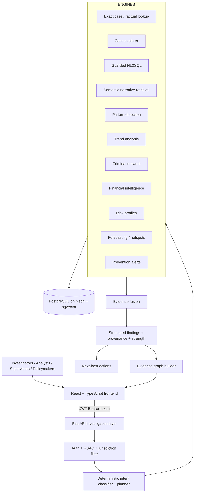
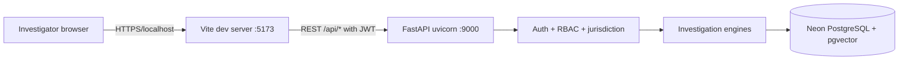
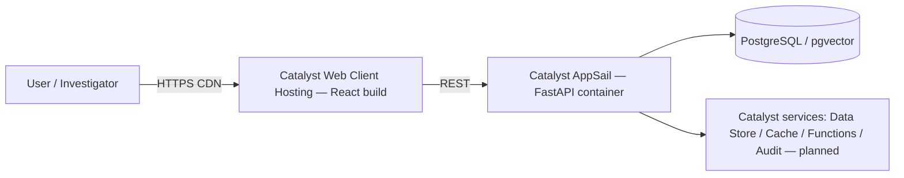

# TriNetra — Evidence-Driven Investigative Intelligence

> **TriNetra turns fragmented crime records into connected, explainable,
> evidence-backed investigative intelligence for investigators, analysts,
> supervisors, and policymakers.**

TriNetra is not a crime-data dashboard and not a generic AI chatbot. It is an
**investigative-intelligence platform**: an investigator's natural-language
question is decomposed into a controlled, scoped investigation plan; specialised
analytical engines run against the authoritative crime database; their outputs
are fused into explainable findings that carry evidence, provenance, and
supporting records; follow-up questions keep the investigation context; and
every surface is authorization-aware.

> **Core philosophy:** `Ask → Understand → Secure → Plan → Analyse → Fuse → Act`

All claims in this document describe the implementation in this repository.
Anything not yet implemented is explicitly labelled **Planned / In Progress**.

---

## Table of Contents

1.  [Problem Statement](#1-problem-statement)
2.  [What TriNetra Does](#2-what-trinetra-does)
3.  [Why TriNetra Is Different](#3-why-trinetra-is-different)
4.  [System Architecture](#4-system-architecture)
5.  [Investigation Flow](#5-investigation-flow)
6.  [The Multi-Engine Investigation Layer](#6-the-multi-engine-investigation-layer)
7.  [Deterministic Intent Routing](#7-deterministic-intent-routing)
8.  [Exact Case / Factual Lookup](#8-exact-case--factual-lookup)
9.  [Scope Honesty & Safety Guardrails](#9-scope-honesty--safety-guardrails)
10. [Investigation Context & Follow-Up Questions](#10-investigation-context--follow-up-questions)
11. [Evidence Fusion & Explainability](#11-evidence-fusion--explainability)
12. [Evidence Graph](#12-evidence-graph)
13. [Criminal Network Intelligence](#13-criminal-network-intelligence)
14. [Financial Intelligence](#14-financial-intelligence)
15. [Pattern, Trend, Behaviour, Risk & Forecasting](#15-pattern-trend-behaviour-risk--forecasting)
16. [Prevention Alerts](#16-prevention-alerts)
17. [Next Best Investigative Actions](#17-next-best-investigative-actions)
18. [Natural Language, Kannada/English & Voice](#18-natural-language-kannadaenglish--voice)
19. [Security & RBAC](#19-security--rbac)
20. [Database & AI Architecture](#20-database--ai-architecture)
21. [Frontend](#21-frontend)
22. [Zoho Catalyst Deployment & Cloud Architecture](#22-zoho-catalyst-deployment--cloud-architecture)
23. [Current Deployment Architecture](#23-current-deployment-architecture)
24. [Real Investigative Workflow Example](#24-real-investigative-workflow-example)
25. [Examples of Investigator Questions](#25-examples-of-investigator-questions)
26. [Testing & Verification](#26-testing--verification)
27. [Current Status](#27-current-status)
28. [Future Roadmap](#29-future-roadmap)

---

## 1. Problem Statement

Crime information is fragmented across many record types:

- **FIR / case records** (`CaseMaster`) with registration dates, statuses, and narratives
- **People** — accused and victims attached to cases
- **Locations** — police-station units and districts
- **Crime taxonomies** — case categories, crime heads, crime sub-heads, gravity/act-section links
- **Behavioural markers** — modus-operandi tags attached to cases
- **Financial data** — suspect accounts and transactions
- **Offender signals** — precomputed risk scores and repeat-offender flags

A conventional dashboard can *display* these records, but investigators still have
to manually search, correlate, and interpret them. Questions such as the following
require connecting records across all of these domains:

- Are apparently separate cases connected?
- Is the same modus operandi appearing repeatedly?
- Do financial transactions link different cases?
- Which historical cases resemble a current FIR?
- What evidence supports a detected relationship?
- What should be examined next — and is any of this visible to *my* jurisdiction?

TriNetra addresses this as an **evidence-to-intelligence workflow**: it maintains
an investigation layer over the records, where natural-language questions become
scoped analytical tasks executed by specialised engines whose outputs are
fused, explained, and turned into actionable leads.

---

## 2. What TriNetra Does

An investigator can type (or speak, in English or Kannada):

```
Investigate the recent vehicle-theft pattern in Bengaluru and identify repeat offenders.
```

TriNetra interprets the request, resolves and validates its scope, selects the
relevant engines, executes them against the crime database, fuses their findings
with provenance, and returns an explainable result with supporting cases and
next-best investigative actions.

```
Fragmented Records
       ↓
Connected Entities
       ↓
Specialized Analysis
       ↓
Evidence Fusion
       ↓
Explainable Findings
       ↓
Investigative Leads
       ↓
Action (investigator in the loop)
```

The system deliberately separates two modes of use:

1. **Conversational investigation** (`POST /api/chat`) — fast intent-routed answers
   for exact lookups, factual retrieval, and single-engine questions, with audit logging.
2. **Multi-engine investigation** (`POST /api/investigate` and the delegated paths
   of `/api/chat`) — plan-based execution across several engines with evidence
   fusion, evidence graphs, and next-action generation.

---

## 3. Why TriNetra Is Different

### Evidence first, not assertion

Analytical findings are traceable to the records that support them. Responses carry
`finding`, `source_engine`, `supporting_count`, case/accused/transaction IDs,
`evidence_strength`, and `explanation`. When the data does **not** support a claim,
the system says so ("insufficient historical data", "scope could not be resolved",
"no active prevention alerts") instead of inventing an answer.

### Multi-engine investigation architecture

The LLM is **not** the whole intelligence system. Every question passes through a
**deterministic intent classifier** that maps it to canonical intents and the
engines allowed to serve them. Specialised engines independently perform:

- exact case/FIR lookup (deterministic SQL)
- factual case retrieval (deterministic parsing + SQL)
- NL2SQL (LLM-assisted, guarded)
- semantic narrative retrieval (RAG + pgvector)
- MO-based pattern clustering
- trend analysis (SQL aggregation)
- criminal-network analysis (NetworkX graph traversal)
- financial analysis (transaction/account graphs)
- risk-profile reads (precomputed offender scores)
- statistical forecasting (Holt-Winters)
- predictive-hotspot classification
- prevention-alert generation
- evidence-graph construction
- next-best-action generation

Why this matters:

- each task uses the appropriate analytical capability,
- unnecessary database/LLM round-trips are avoided,
- results are easier to reason about and audit,
- failures are isolated per engine,
- a single model can never silently decide to broaden scope or fabricate records.

### Deterministic intent routing with LLM enrichment only

Intent and engine selection are decided by deterministic rules
(`engines/intent_classifier.py`) that the LLM **cannot override**; the LLM fills in
scope details (district, crime, time, entity IDs) for plan generation. See
[Section 7](#7-deterministic-intent-routing).

### Scope-safe analysis

An explicitly requested crime, district, or time scope is resolved to real database
IDs and validated before any engine runs. An explicit scope that cannot be resolved
produces a structured stop — never a silent broadening into unrestricted analysis.
See [Section 9](#9-scope-honesty--safety-guardrails).

### Deterministic critical operations

Scope resolution, RBAC filters, exact-case resolution, factual parsing, financial
anomaly signals, prevention-alert scoring, evidence-graph construction, and
next-best-action extraction are implemented as deterministic, data-driven code —
reproducible and testable rather than model-generated.

### Authorization-aware by design

JWT authentication, role-based access control, and jurisdiction-scoped SQL filters
are enforced server-side on every data surface. See [Section 19](#19-security--rbac).

### Investigator remains in control

TriNetra produces **decision support**. It does not establish guilt, does not make
autonomous law-enforcement decisions, and does not claim a threat exists unless the
underlying data supports it.

---

## 4. System Architecture



- **Backend:** Python + FastAPI in `TriNetra/trinetra-backend/app.py`, engines in `engines/`.
- **Frontend:** React 19 + TypeScript + Vite in `TriNetra/trinetra-client`.
- **Data:** Neon-hosted PostgreSQL with the `vector` (pgvector) extension for
  semantic retrieval over case narratives.
- **Language layer:** external LLM (Groq-hosted `openai/gpt-oss-120b`) for
  classification fallback / planning / text synthesis; Google Gemini
  (`gemini-embedding-001`, 768-d) for embeddings; Sarvam AI for
  Kannada/English speech-to-text and translation.

The current production target is a **local/development deployment** (uvicorn + Vite);
Zoho Catalyst integration is tracked as In Progress — see [Section 22](#22-zoho-catalyst-deployment--cloud-architecture).

---

## 5. Investigation Flow

Every stage below exists in the implementation:

```
Investigator question
        ↓
Intent classification          (deterministic rules first; LLM only when no rule matches)
        ↓
Exact-case resolution          (entity-first: one FIR ID → that authoritative record)
        ↓
Scope + entity resolution      (district/unit/crime/status → real DB IDs)
        ↓
RBAC enforcement               (jurisdiction filter is injected server-side)
        ↓
Investigation planning         (engine selection — LLM may enrich parameters, never intent)
        ↓
Engine execution               (relevant engines run on scoped data)
        ↓
Evidence fusion                (findings + provenance + strength)
        ↓
Structured response            (findings, evidence inventory, graph/analytics payloads)
        ↓
Drill-down                    (Evidence Graph / Cases / Financial Trail / Next Actions)
```

### What each stage guarantees

1. **Ask** — the investigator submits a natural-language or voice question with
   optional crime/location/time/entity constraints.
2. **Understand** — the deterministic classifier decides *what* is being asked
   (14 canonical intents) and *which engines* may answer it.
3. **Secure** — JWT verification, role lookup from the employee database, and a
   mandatory row-level jurisdiction condition are applied before any query.
4. **Plan** — for multi-engine questions, the planner builds a structured plan:
   scope, objectives, entity anchors, and the ordered engine list.
5. **Analyse** — selected engines execute independently against the scoped data.
6. **Fuse** — evidence is normalised into traceable records with supporting counts
   and an aggregate strength; a multi-engine conclusion is only "strong" when
   several independent engines support it.
7. **Act** — the investigator receives findings, evidence, and next-best actions
   to review — the platform never acts on its own.

---

## 6. The Multi-Engine Investigation Layer

### Engine modules in this repository

| Engine | Module | What it does |
|---|---|---|
| Deterministic intent classifier | `engines/intent_classifier.py` | Routing policy: intent catalogue, per-intent engine policy, entity-centric rules, follow-up/new-scope detection |
| Intent router | `engines/router.py` | Runs the classifier, then LLM fallback; query rewriting for follow-ups |
| Exact case resolver | `engines/exact_case.py` | One FIR/case ID → one authoritative record → verified facts |
| Factual case lookup | `engines/factual_lookup.py` | Deterministic parsing of simple case questions (location/crime/recency) |
| Location/crime/status resolver | `engines/location_resolver.py` | Free-text phrases → real District / Unit / CrimeSubHead / CrimeHead / status IDs |
| Case explorer | `engines/case_explorer.py` | Paginated, filterable case search + full case detail with RBAC filter |
| NL2SQL | `engines/nl2sql.py` | LLM-generated `SELECT` with guardrails + mandatory RBAC condition |
| RAG | `engines/rag.py` | Embedding-based narrative retrieval + grounded summarisation |
| Pattern engine | `engines/pattern_engine.py` | MO-surge clustering; multi-signal case similarity (pgvector + MO + geo + time) |
| Analytics engine | `engines/analytics.py` | Dashboard KPIs, trends, geographic/geographic grids, offender profiles & risk reads |
| Network engine | `engines/network_engine.py` + `engines/graph.py` | Multi-layer criminal network via NetworkX + Louvain community detection |
| Financial intelligence | `engines/financial_intelligence.py` | Account/transaction analysis, cross-case links, chains, deterministic anomaly signals, leads |
| Forecasting | `engines/forecasting.py` | Holt-Winters monthly category forecasts with evaluation vs seasonal-naive baseline |
| Predictive hotspots | `engines/predictive_hotspots.py` | Historical / emerging / predicted hotspot classification |
| Prevention alerts | `engines/prevention_alerts.py` | Evidence-gated early-warning alerts over real case data |
| Evidence graph | `engines/evidence_graph.py` | Findings → graph nodes/edges with provenance |
| Next best action | `engines/next_best_action.py` | Findings → deterministic, evidence-backed investigative leads |
| Investigation planner/orchestrator | `engines/investigation.py` | Plan creation, scope validation, engine execution, evidence fusion, response building |
| Voice/language | `engines/sarvam_engine.py` | Sarvam AI STT (`saaras:v3`) + translation (`sarvam-translate:v1`) |
| Auth | `engines/auth.py` | Employee login, bcrypt verification, rank→role mapping, JWT issue/verify |
| Security context | `engines/security.py` | Jurisdiction SQL filters + `QueryAuditLog` writes |

### Planning catalogue

`InvestigationPlanner.VALID_ENGINES` (the engines a plan may execute):
`case_query`, `case_similarity`, `criminal_network`, `risk_profile`,
`pattern_detection`, `narrative_rag`, `trend_analysis`, `financial_intelligence`.

---

## 7. Deterministic Intent Routing

`DeterministicIntentClassifier` defines a **canonical intent catalogue** — the same
labels used by the UI and the audit log:

| Intent | Meaning | Allowed engines (policy) |
|---|---|---|
| `exact_case_lookup` | one identifier, one authoritative record | `exact_case_lookup` |
| `case_search` | record retrieval by filters | `case_query` |
| `case_similarity` | cases similar to a specific FIR | `case_similarity`, `case_query` |
| `narrative_similarity` | similar MO / narrative description | `narrative_rag`, `case_similarity`, `pattern_detection`, `case_query` |
| `pattern_detection` | recurring patterns / common MO / clusters | `pattern_detection`, `case_query` |
| `trend_analysis` | time-series / increase-decrease over time | `trend_analysis` |
| `criminal_network` | who is connected / co-accused / syndicate | `criminal_network` |
| `financial_analysis` | money trails / transactions / accounts | `financial_intelligence`, `case_query` |
| `behaviour_analysis` | repeated behaviour of offenders | `pattern_detection`, `case_query`, `risk_profile` |
| `risk_analysis` | risk profile / re-offending likelihood | `risk_profile` |
| `forecasting` | future outlook / prediction | `forecasting` |
| `evidence_graph` | evidence relationships / cross-case links | `case_query`, `criminal_network`, `financial_intelligence` |
| `next_best_action` | recommended next investigative step | `next_best_action` |
| `general_investigation` | broad fallback | `case_query`, `pattern_detection` |

Key rules implemented in code:

- **Deterministic rules run first.** A matched deterministic rule decides intent and
  engine; the LLM cannot change it (it only enriches parameters).
- **Entity-centric intents** (`financial_analysis`, `criminal_network`,
  `risk_analysis`, `case_similarity`) must never become a broad, unfiltered case
  list: they require an explicit entity, a resolved investigation context, or an
  explicitly scoped case set.
- **No silent engine fallback.** If the engines an intent needs cannot run (no
  entity, unresolved scope), the pipeline returns "context required" / "scope
  unresolved" rather than substituting a different engine.
- **LLM fallback** only classifies when no deterministic rule matches, into one of
  six classic engines (`factual_lookup`, `criminal_network`, `trend_analysis`,
  `risk_profile`, `narrative_rag`, `case_similarity`), and its choice is validated
  against the allow-list.

Routing examples supported by the classifier and regression tests:

| Question | Route |
|---|---|
| "Find cases similar to FIR 100050030202600014" | `case_similarity` |
| "Find cases with a similar modus operandi to forced-entry burglary" | `narrative_similarity` |
| "Do we have a recurring pattern of motor vehicle theft?" | `pattern_detection` |
| "How has motor vehicle theft changed over the last 6 months?" | `trend_analysis` |
| "Show the financial trail for FIR 100050030202600014" | `financial_analysis` |
| "Who is connected to FIR 100050030202600014?" | `criminal_network` |
| "What is the crime outlook for the next 6 months?" | `forecasting` |
| "What is FIR 100050030202600014?" | `exact_case_lookup` |
| "Show the latest cases registered in Bengaluru Urban" | `case_search` |

---

## 8. Exact Case / Factual Lookup

### Exact-case resolver — entity-first routing

Core rule enforced in code: **one ID → one authoritative record → verified facts → explanation**.

When an investigator names a specific FIR/case, the question is about *that record*.
Crime/location/status words in such a question are treated as **verification** or
**attribute** questions ("is FIR X a vehicle-theft case?", "what crime is FIR X?"),
never as broad database filters.

Supported identifier formats (resolved against real tables):

- `CrimeNo` — 18-digit numeric (e.g. `100050030202600014`)
- `CaseNo` — short per-year number (e.g. `202600014`)
- `CaseMasterID` — small integer (e.g. `2598`)

Resolution order is `CrimeNo → CaseNo → CaseMasterID`, always with parameterised SQL
and the mandatory RBAC condition. Invalid or out-of-scope IDs return an honest
"not found in authorized records" result — never a broadened search.

**Analysis-anchor guard.** A query that names an exact FIR but asks for *analysis of
that FIR* is not an exact-case lookup. "Find cases similar to FIR X", "show the
financial trail for FIR X", "who is connected to FIR X" keep the FIR as an *anchor
entity* and are routed to the similarity / financial / network engines instead of
being swallowed by an exact-record answer.

| Question | Behaviour |
|---|---|
| "What is FIR 100050030202600014?" | exact case lookup → verified record summary |
| "Is FIR 100050030202600014 a vehicle-theft case?" | factual verification against the record |
| "Find cases similar to FIR 100050030202600014" | analysis anchored to that FIR (case similarity) |
| "Show the financial trail for FIR 100050030202600014" | analysis anchored to that FIR (financial) |

### Deterministic factual case lookup

`FactualCaseLookup` handles simple database questions without an LLM deciding facts:

- "details about the last cases registered in Bengaluru Urban central"
- "Show the latest 5 cases in Bengaluru."
- "How many cases were registered this month in Mysuru?"

The pipeline is fully deterministic after parsing: intent check → location
resolution (real District/Unit IDs, with aliases such as *Bangalore*→*Bengaluru*)
→ crime/status resolution (real lookup IDs) → recency/limit parsing → RBAC
authorisation appended as a SQL condition → case query → structured response.

Analysis-flavoured questions (pattern, network, risk, trend, similarity, follow-ups
referring to people/previous results) are deliberately blocked from this path so a
deterministic lookup can never hijack an investigation question.

### Guarded NL2SQL (fallback)

Questions the deterministic paths do not recognise fall back to LLM-to-SQL
(`engines/nl2sql.py`) with four guardrails enforced before execution:

1. multi-statement sequences are rejected;
2. only `SELECT` (read) statements are permitted;
3. only whitelisted tables are allowed;
4. an automatic `LIMIT 200` cap is applied if the LLM omitted one.

The generated SQL always contains the injected jurisdiction condition
(`AND (rbac_filter)`), and a single automatic self-repair retry happens on error.

---

## 9. Scope Honesty & Safety Guardrails

Scope safety is a central correctness feature, enforced by
`investigation.py`'s scope validation and "scope firewall".

### Explicit vs generic scope

- If the user explicitly requests a crime category, district, or time window, that
  scope is resolved to real database IDs and validated **before** scoped engines run.
- If an explicitly requested scope **cannot be resolved**
  (`crime_category_unresolved` / `district_unresolved`), the pipeline emits a
  structured warning and **stops**: no engines run on a broadened scope.
- Generic queries with **no** explicit scope may legitimately use general
  emerging-pattern analysis.

Example of the safety property (as enforced, not aspirational):

> "Show cases of an unknown/unsupported crime category in Bengaluru" must **not**
> silently become "show all cases in Bengaluru". The system reports that the
> requested crime scope could not be resolved and does not substitute a broader query.

### Other enforced rules

- **Entity-centric questions without context** (financial trail, network,
  risk, similarity with no entity named and no prior investigation) return a
  "context required" response instead of an unrelated state-wide search.
- **Invalid FIR IDs** never trigger broad fallback searches.
- **Analysis questions anchored to an FIR** stay anchored to that resolved case;
  they are not rerouted to exact-case lookup or to unrelated case lists.
- **New-scope detection**: a follow-up that defines a new crime/location/time scope
  deliberately replaces the previous investigation context (no leakage of the old
  FIR's entities into the new scope).

---

## 10. Investigation Context & Follow-Up Questions

The backend keeps an in-memory session store (TTL 30 minutes) per `session_token`
with the last investigation's resolved scope and discovered entities.

```
"What is FIR 100050030202600014?"   → exact case resolved + stored as context
"Who is connected to it?"           → uses the previously resolved case
"Show their transaction trail"      → continues from the discovered accused
"Now show recent burglary cases in Mysuru" → new scope detected → context replaced
```

Implementation notes (all verified in `app.py` / `investigation.py`):

- **Discovered-entity propagation** — case/accused IDs found in a prior turn are
  merged into follow-ups, so "show their financial trail" retains the accused it
  refers to.
- **Deterministic follow-up handling** — pronoun-heavy follow-ups skip the
  (nondeterministic) LLM context rewrite; rewrite is used only where safe.
- **New-scope reset** — when the follow-up defines a new scope, old entities are
  deliberately not merged, preventing cross-investigation leakage.
- **Exact-case context** is stored without crime/location filters — the discovered
  case ID is the context, never a broad filter.

---

## 11. Evidence Fusion & Explainability

### Structured evidence records

`investigation.py` normalises raw engine results into compact, LLM-safe records:

```
{
  "finding": str,
  "source_engine": str,
  "type": str,
  "supporting_count": int,
  "case_ids": [...], "accused_ids": [...], "transaction_ids": [...],
  "scope": {...},
  "evidence_strength": str,     # strong | moderate | limited | none
  "explanation": str
}
```

### Strength is computed, not asserted

`_aggregate_strength()` applies deterministic rules:

- **Single-engine results** (e.g. a plain case query): the engine's own strength
  stands — a query that found 10 real records reports `strong`, because the records
  themselves are the ground truth.
- **Multi-engine conclusions**: `strong` requires at least **two independent
  strong** sources; `moderate` requires one strong + a moderate, or three or more
  moderate sources. A lone strong engine is **not** enough to claim a strong
  multi-engine conclusion.

### Findings → text

The LLM is used only to turn already-computed evidence into a concise natural-language
summary with strict "never invent data" instructions at temperature 0 — it never
decides whether a finding exists or what the evidence is.

---

## 12. Evidence Graph

`POST /api/evidence/graph` builds a structured, provenance-carrying graph from an
investigation finding. Every node is a real entity and every edge a real
relationship:

- **Case similarity** graphs: target case → similarity signals (narrative %, shared
  MO tags, geo-proximity, temporal proximity) → matched cases.
- **Pattern graphs**: pattern cluster → MO tags → member cases.
- **Network graphs**: people → relationship edges with the underlying case/relation.
- **Risk graphs**: person → risk score → contributing factors.
- **Case-list graphs**: cases identified by a query.

Edges carry metadata such as relationship type, strength, source engine, and the
specific supporting evidence (`source_records`).

On the frontend, an interactive **EvidenceGraph** component (React Flow) renders the
nodes/edges, and each finding offers a "view evidence / graph" action; findings from
the investigation pipeline can also ship a prebuilt `combined_evidence_graph`.

The graph answers *"why was this surfaced?"* — tables show records; the evidence
graph exposes the connections between records and the evidence behind each
connection.

---

## 13. Criminal Network Intelligence

`engines/network_engine.py` builds a multi-layer NetworkX graph over accused
entities with five edge types:

| Edge type | Meaning |
|---|---|
| `co_accused` | shared a case (FIR) |
| `financial` | money flow between suspect accounts |
| `repeat_identity` | same person across different cases |
| `shared_mo` | same modus-operandi tag (indirect pattern link) |
| `victim_accused` | person is a victim in one case and accused in another |

Community detection uses the Louvain method (`python-louvain`), and the REST
endpoints expose:

- `GET /api/network/search?q=` — jurisdiction-scoped accused search,
- `GET /api/network/{accused_id}?hops=N&layers=...` — N-hop (≤3) subgraph traversal,
- `GET /api/network/node/{accused_id}` — node detail panel data.

An investigator can move **FIR → person → connected case → relationship → financial
trail**, with RBAC enforced on the *anchor* entity (an accused outside the caller's
jurisdiction returns 404, identical to an unknown person).

The interactive graph is rendered with React Flow in the Network Analysis page,
with layer toggles and community colouring.

---

## 14. Financial Intelligence

`engines/financial_intelligence.py` is an evidence-grounded money-trail engine
working from the real `SuspectAccount` / `FinancialTransaction` tables:

```
Accused ─ owns → Account ─ transfers → Account ─ owns → Accused (possibly in another case)
```

`POST /api/financial/analyze` returns:

- suspect accounts for the investigation entities (accused/case anchored),
- transactions (with time filters),
- **cross-case financial links** (an account/counterparty touching multiple cases),
- **shared accounts** (an account linked to multiple accused),
- **transaction chains** (multi-hop movement paths),
- deterministic **anomaly signals** derived from the data (e.g. high-volume /
  high-value / rapid-movement / bidirectional / cross-case patterns) — each one a
  *signal for investigation*, not proof of crime,
- a graph payload and aggregate summary,
- **financial leads** via `FinancialLeadGenerator` (evidence-backed, deterministic).

Access controls (server-side):

- **Investigator** → only accused linked to a case at their own station;
- **Supervisor** → accused within their own district;
- **Analyst / Policymaker** → any entity they pass (state-wide surface);
- restricted roles never receive an unbounded account dump.

`GET /api/financial/account/{account_id}` returns account detail with **masked**
account numbers (`XXXX-1234`) both server-side and in the UI, and enforces the same
jurisdiction rule before returning transactions.

The Financial Trail page (frontend) walks the investigator through stages —
overview, relationships, money flow, suspicious activity, cross-case, next steps,
evidence — rather than showing only a raw graph.

---

## 15. Pattern, Trend, Behaviour, Risk & Forecasting

These are distinct capabilities with distinct engines; the intent classifier keeps
them apart so "do we have a recurring pattern?" is never answered as a trend chart.

| Capability | Engine | What it actually does |
|---|---|---|
| **Pattern detection** | `pattern_engine.py` | Groups cases whose modus-operandi tags surged recently (90-day window); returns clusters with member cases, districts, sparklines, and trigger reasons. Explicitly not "same offender" proof |
| **Case similarity** | `pattern_engine.find_similar_cases` | Multi-signal composite score (0–99): pgvector narrative cosine similarity, shared MO tags, geo-proximity, temporal proximity — each match with per-signal explanations |
| **Trend analysis** | `analytics.py` + guarded NL2SQL | Monthly/period aggregations of case volume with category/district/time filters (YoY views, anomaly callouts in the advanced trends endpoint) |
| **Behaviour analysis** | routing-level intent → `pattern_detection` + `risk_profile` | Repeated behaviour of offenders is answered by recurring-pattern evidence and offender risk data — there is no separate "behaviour model" |
| **Risk analysis** | `analytics.get_risk_profile` / `get_offenders` | Reads precomputed `OffenderRiskScore` rows (score 0–100, repeat-offender flag, contributing factors). Offender Profiles UI + chat `risk_profile` route |
| **Forecasting** | `forecasting.py` | Holt-Winters triple exponential smoothing (additive seasonality, 12-month period) on monthly case counts; compares against a seasonal-naive baseline and reports MAE / RMSE / MAPE on a train/test split; returns prediction intervals and directional signals |
| **Predictive hotspots** | `predictive_hotspots.py` | Classifies areas as **historical**, **emerging**, or **predicted** hotspots from observed density, recent acceleration, and forecasted activity |

Forecasting is gated on data sufficiency: with fewer than ~12 months of history, or
a partial current month, the engine reports that a reliable forecast is not possible
rather than emitting a spurious number. Risk scores are prioritisation signals, not
judgements of guilt or future behaviour.

---

## 16. Prevention Alerts

`GET /api/analytics/alerts` computes real, database-driven early-warning alerts —
never fabricated placeholders. The engine (`engines/prevention_alerts.py`):

1. resolves the caller's jurisdiction server-side from the JWT profile
   (Investigator → station, Supervisor → district, Analyst/Policymaker → state-wide;
   an explicit `district_id` can never widen a restricted role's scope);
2. anchors time windows to the newest record in scope (recent 30 days vs the two
   prior 30-day windows; 90-day lookback for modus-operandi signals);
3. computes deterministic signals: rising activity per crime sub-head,
   station-level geographic clusters, recurring MO tags, and Holt-Winters forecast
   elevation (gated on ≥12 months of history + a complete trailing month + volume
   floors);
4. scores alerts transparently (0–100 components) into HIGH / MEDIUM / LOW;
5. returns evidence-first alert objects — `alert_type`, `severity`,
   `crime_category`, `location`, `time_window`, `title`, `summary`, `evidence`,
   `supporting_case_count`, `trend_change`, `source_engines`, `confidence`,
   `recommended_actions`, and the supporting FIRs.

If the data does not support any alert, the response is an honest empty state
("No active prevention alerts — current crime data does not show a sufficiently
strong emerging pattern within your jurisdiction") with a "data reviewed" summary,
instead of a manufactured alert.

The Prevention Alerts page (frontend) renders these alerts with evidence, actions,
evidence-graph drill-down, and case links, and offers a district selector to
state-wide roles.

---

## 17. Next Best Investigative Actions

`POST /api/investigation/next-actions` (`engines/next_best_action.py`) converts an
investigation result into ranked investigative leads. The pipeline is:

```
Findings → CandidateLeadExtractor → LeadDeduplicator → LeadRanker → structured leads
```

- **No LLM is used for lead generation** — every lead is deterministic and
  traceable to evidence (e.g. a ≥70% similar case becomes "review case X", a
  pattern cluster becomes "review member cases", a network edge becomes
  "examine co-accused link", risk factors become review items).
- Leads carry `priority`, `reason`, `source_engines`, and target entity references.
- The chat UI renders these as "Next Best Actions" after an investigation.

TriNetra **surfaces evidence-backed leads for investigator review** — it does not
make autonomous decisions.

---

## 18. Natural Language, Kannada/English & Voice

The Ask TriNetra interface accepts text and voice in **English** and **Kannada**:

- **Voice**: the browser records audio (MediaRecorder) and uploads it to
  `POST /api/sarvam/stt`, which transcribes via Sarvam AI speech-to-text
  (`saaras:v3`; language code `kn-IN` or `en-IN`).
- **Kannada mode**: when the toggle is set to Kannada, the typed/spoken Kannada
  query is translated to English (`POST /api/sarvam/translate`,
  `sarvam-translate:v1`) before the investigation engines run, and the final
  answer is translated back into Kannada for display. English mode passes through
  untranslated.
- The underlying Sarvam integration also supports other Indian language codes at
  the API level; the UI currently offers the English/Kannada toggle.

Example investigator-style questions work in either language:

- "What is the current status of FIR …?"
- "Show vehicle theft cases in Bengaluru during the last 3 months."
- "ಯಾವ ಆರೋಪಿಗಳು ಒಂದಕ್ಕಿಂತ ಹೆಚ್ಚು ಬಾರಿ ಕಾಣಿಸಿಕೊಳ್ಳುತ್ತಾರೆ?" (which offenders appear more than once)

Session transcripts can be exported as a styled HTML investigation report
(`POST /api/chat/export`).

---

## 19. Security & RBAC

### Authentication

- Login (`POST /api/login`) verifies the employee against `EmployeeCredentials`
  (bcrypt) and issues an **HS256 JWT** carrying employee ID, name, role,
  district/unit IDs, and a 24-hour expiry.
- All data endpoints require the JWT (`Authorization: Bearer …`) — missing or
  invalid tokens receive 401; the role/district/unit used for authorisation are
  always re-read from the employee database on each request, never trusted from
  the client.

### Role model (rank → role)

Ranks map to roles in `auth.py`:

| Role | Typical ranks | Jurisdiction |
|---|---|---|
| **Policymaker** | DGP / ADGP / IGP / Director-level | state-wide |
| **Analyst** | SP / Superintendent / DySP | state-wide (may select any district for analytics) |
| **Supervisor** | Inspector / CI / Circle-level | own district |
| **Investigator** | other police ranks (incl. PSI/CPI) | own station (unit) |

Unknown roles are denied (`1=0`), never widened.

### Row-level enforcement

`SecurityContext.build_rbac_filter` generates the SQL condition used as a
**mandatory** filter on the SQL-backed surfaces:

- Investigator → `PoliceStationID = <own unit>`
- Supervisor → `DistrictID = <own district>`
- Analyst / Policymaker → state-wide (`1=1`)
- anything else → `1=0` (fail closed)

Surfaces that apply it: chat/NL2SQL, exact-case lookup, factual lookup, case
search/detail, pattern feeds, similar-cases reference checks, offender profiles,
forecasting, prevention alerts, network endpoints (anchor scope), and financial
analysis (station/district-bounded entity resolution). Case detail and anchor-entity
endpoints return **404 for out-of-scope records** — identical to an unknown record —
so restricted users cannot probe for the existence of foreign data. Analytics
aggregates force an Investigator/Supervisor's `district_id` to their own district
server-side.

### Guardrails and privacy

- **SQL safety**: parameterised queries everywhere; the NL2SQL path adds
  read-only/whitelist/multi-statement/LIMIT guardrails (Section 8).
- **Financial privacy**: account numbers are masked (`XXXX-1234`); financial
  analysis is entity/case-anchored for restricted roles.
- **Demographics privacy**: cohort cells with fewer than 10 records are redacted
  (`Redacted (n<10)`).
- **Audit trail**: `SecurityContext.log_audit` inserts an immutable row into
  `QueryAuditLog` (employee, role, raw query, engine, resolved query, row count)
  for chat, investigation, forecast, and hotspot flows; a write failure logs a
  critical warning but never fails the request.

### Known limitation (stated honestly)

The **semantic narrative retrieval (RAG) path currently queries the whole
narrative corpus without a jurisdiction filter** — the RAG module notes that RBAC
filtering is future work. All other SQL-backed retrieval and analytics surfaces are RBAC-filtered;
narrative-similarity queries are the documented exception. This is a recognised
limitation for production, not a claimed capability.

---

## 20. Database & AI Architecture

### Data foundation

- **PostgreSQL**, hosted on **Neon**, accessed through `psycopg2` with
  parameterised queries.
- **pgvector** (`vector` extension): `CaseNarrativeEmbedding` stores 768-dimension
  embeddings of case narratives; cosine similarity (`<=>`) powers RAG retrieval and
  part of case similarity. The similarity engine degrades gracefully if the
  extension/table is unavailable (falls back to MO + geo + time signals).
- Schema domains follow the Karnataka police data model: `CaseMaster`, `Unit`,
  `District`, `CaseStatusMaster`, `CaseCategory`, `CrimeHead`, `CrimeSubHead`,
  `Accused`, `Victim`, `ModusOperandi`/`MOTagMaster`, `SuspectAccount`,
  `FinancialTransaction`, `OffenderRiskScore`, `Employee`/`EmployeeCredentials`,
  and supporting lookup tables.

### Current dataset (seeded for development/demo)

The repository ships a **fully synthetic but structurally realistic Karnataka
police-domain dataset** (see `DataGeneration/DATASET_README.md`) generated from the
schema and loaded into the Neon database:

| Dimension | Value |
|---|---|
| FIRs (`CaseMaster`) | 2,896 across Jan 2024 – Jul 2026 |
| Districts / stations | 31 / 126 |
| Accused / victims | 3,827 / 4,530 |
| MO tags applied (links) | 1,827 across 17 tags |
| Suspect accounts / transactions | 25 / 58 (small, deliberately curated mule chains) |
| Offender risk scores | 3,827 |

The dataset is weighted so Bengaluru Urban carries ~20% of volume, cyber crime grows
year over year, property crime peaks in the festival months, and eight organised-crime
storylines + repeat offenders are seeded so pattern/network/financial/prevention
demos have real, verifiable structure to find.

### AI layer

| Capability | Provider / model | Used for |
|---|---|---|
| Chat/synthesis LLM | Groq-hosted `openai/gpt-oss-120b` | RAG summarisation, NL2SQL generation, plan generation, final text synthesis, classification fallback (all at temperature 0 with strict anti-invention instructions) |
| Embeddings | Google Gemini `gemini-embedding-001` (768-d) | Case-narrative vectors; seeded by `seed_vector_db.py` |
| Speech/translation | Sarvam AI `saaras:v3` STT, `sarvam-translate:v1` | Kannada/English voice input + Kannada query/answer translation |

All credentials live in environment variables (`.env` is git-ignored): `GROQ_API_KEY`,
`GEMINI_API_KEY`, `NEON_DATABASE_URL`, `SARVAM_API_KEY`, `JWT_SECRET`.

---

## 21. Frontend

- **Stack**: React 19 + TypeScript + Vite, Tailwind CSS, React Router; axios/fetch
  API client in `src/services/api.ts`.
- **Visualisations**: React Flow (network + evidence graphs), Recharts (trends and
  analytics charts), react-leaflet with OpenStreetMap tiles (crime maps,
  pattern clusters, forecast hotspots).
- **Pages**: Landing, Login, Dashboard, Ask TriNetra, Case Explorer, Network
  Analysis, Crime Analytics, Pattern Analytics, Offender Profiles, Prevention
  Alerts, Crime Forecast, Financial Trail, Architecture Diagram, Profile.

Key interaction surfaces:

- **Ask TriNetra** — conversational chat with engine/intent labels, reasoning
  trace, investigation findings, evidence inventory, next-best-actions, evidence
  graphs, voice (EN/KN), Kannada translation toggle, and HTML export.
- **Case Explorer** — filterable, paginated case search with map view and full case
  detail (timeline, people, chargesheet).
- **Network Analysis** — search + multi-hop network graph with layer toggles and
  node detail.
- **Crime Analytics / Pattern Analytics / Forecast / Prevention Alerts** —
  jurisdiction-aware dashboards backed by the analytics, pattern, forecasting and
  prevention endpoints.
- **Financial Trail** — staged financial investigation UI (overview → relationships
  → money flow → suspicious activity → cross-case → next steps → evidence) with
  masked account numbers.
- **Architecture Diagram** — an interactive architecture map that visually
  distinguishes implemented layers from the **Zoho Catalyst (In Progress)** group.

The client keeps the JWT and profile in `AuthContext`/localStorage and attaches the
token to every API call. Access control is enforced **server-side**: every data
endpoint validates the JWT and re-derives role/district/unit from the employee
database — the client carries no trust boundary of its own.

**Known status:** the client runs under Vite dev, but a full strict `tsc` build
currently reports pre-existing type errors (mostly unused-symbol/duplicate-prop
errors in `ArchitecturePage.tsx` and `FinancialTrailPage.tsx`; none in the
chat/prevention/analytics code paths). See [Section 26](#26-testing--verification).

---

## 22. Zoho Catalyst Deployment & Cloud Architecture

**Status: Integration In Progress — no Catalyst service is live from this
repository.** This section is written to be unambiguous about what exists today.

### Currently used in the repository

- **Catalyst-schema data mirror (CSV)**: `Catalyst_Schema_CSVs/` contains the
  Catalyst Data Store table schemas/data (CaseMaster, District, Unit, Employee,
  Accused, SuspectAccount, FinancialTransaction, MOTagMaster, CrimeHead,
  CrimeSubHead, Victim, …) exported to CSV for local development seeding.
- **SDK dependency**: `zcatalyst_sdk==1.4.0` is pinned in
  `trinetra-backend/requirements.txt`, but **no runtime code imports it**.
- **Code comments reference the production path**: `engines/database.py` notes that
  in production the data class "will use `catalyst_app.zcql().execute_query()`" —
  an aspirational comment, not wired code.
- **Frontend Architecture page** labels the entire Zoho Catalyst group as
  **"In Progress"** (AppSail backend deployment, AppSail frontend hosting, Data
  Store, Cache, Signals, Functions, Catalyst LLM, Catalyst transcription).

There is **no** committed deployment configuration in the repository: no
`Dockerfile`, no `catalyst.json`, no `.catalyst/` metadata (it is git-ignored
"just in case"), no AppSail manifest, and no environment/secrets binding to
Catalyst. The application currently runs as a local FastAPI process against a Neon
PostgreSQL database.

### Catalyst services planned / in progress (future integration)

The architecture page and roadmap track these as next-step capabilities — none are
operational in this repository:

| Service | Intended role | Status |
|---|---|---|
| Catalyst AppSail | Docker-based deployment of the FastAPI backend (Python 3.11) | Planned / In Progress |
| Catalyst Web Client Hosting / AppSail static | hosting the React build | Planned / In Progress |
| Catalyst Data Store + ZCQL | managed data layer replacing direct PostgreSQL access | Planned |
| Catalyst Cache | session/cache layer | Planned |
| Catalyst Signals / Functions | event-driven compute and workflow triggers | Planned |
| Catalyst Audit Logs | managed audit logging | Planned |
| Catalyst LLM / transcription | managed AI service layer | Planned |

### Why Catalyst fits TriNetra

Catalyst is the intended productionization path for the platform: containerised
backend execution, managed hosting for the React frontend, centralised
configuration/secrets, managed data, cache and audit services — while the
domain-specific investigation engines remain modular and portable. Today this
remains the deployment roadmap, clearly separate from the implemented system.

---

## 23. Current Deployment Architecture

### As deployed today (local development)



### Target (Catalyst — planned)



---

## 24. Real Investigative Workflow Example

The following flow is supported end-to-end by the implemented pipeline:

**Turn 1**
> Investigator: *"Find cases similar to FIR 100050030202600014."*

1. The query is classified (deterministic rule: `case_similarity`) and the FIR is
   resolved to its authoritative record under the caller's RBAC filter.
2. The planner builds a plan: `case_similarity` + `case_query` anchored on the FIR.
3. The similarity engine scores candidates using pgvector narrative similarity,
   shared MO tags, geo-proximity, and temporal proximity, with per-match
   explanations.
4. Findings are fused with provenance; matched cases are returned with match
   scores, and drill-downs (view case, evidence graph) are offered.

**Turn 2**
> Investigator: *"Who is connected to it?"*

5. The follow-up reference is detected deterministically; the stored investigation
   context (the FIR and any accused discovered so far) is carried forward.
6. The criminal-network engine maps the surrounding subgraph (co-accused,
   financial, repeat-identity, shared-MO, victim-accused edges) around the case's
   people.

**Turn 3**
> Investigator: *"Show their transaction trail."*

7. The discovered accused are passed to the financial intelligence engine; suspect
   accounts, transactions, cross-case links, chains, and deterministic anomaly
   signals are returned with masked account numbers.

**Turn 4**
> Investigator: *"Now show recent burglary cases in Mysuru."*

8. `defines_new_scope()` detects a brand-new crime/location scope; the previous
   FIR/accused context is deliberately discarded so nothing from the old
   investigation leaks into the new case list.

At every turn the jurisdiction filter for the authenticated user is applied
server-side and the interaction is written to the audit log.

---

## 25. Examples of Investigator Questions

Grouped by the implemented capability they route to:

**Exact case / factual (case)**
- "What is FIR 100050030202600014?"
- "What is the current status of FIR 100050030202600014?"
- "Show the latest cases registered in Bengaluru Urban."
- "How many cases were registered in Bengaluru Urban in 2025?"

**Similarity**
- "Find cases similar to FIR 100050030202600014."
- "Find cases with a similar modus operandi to forced-entry burglary."

**Pattern**
- "Do we have a recurring pattern of motor vehicle theft?"

**Trend**
- "How has motor vehicle theft changed over the last 6 months?"

**Financial**
- "Show the financial trail for FIR 100050030202600014."
- "Who shares accounts or has cross-case financial links?"

**Network**
- "Who is connected to FIR 100050030202600014?"

**Forecast / hotspots**
- "What is the crime outlook for the next 6 months?"

**Risk**
- "What is the risk score for accused 3682?"

**Follow-up**
- "Who are the connected suspects?" → "Show their transaction trail."
- "Now show recent burglary cases in Mysuru." (new scope)

---

## 26. Testing & Verification

Test suites live in `TriNetra/trinetra-backend/Testing/`.

### Backend test suites (pytest)

| Suite | Verifies |
|---|---|
| `test_prevention_alerts.py` | RBAC/jurisdiction scoping, deterministic evidence, honest empty state, supporting-FIR integrity (17 tests) |
| `test_exact_case_lookup.py` | entity-first exact lookup; analysis questions are not hijacked into exact lookup; invalid/out-of-scope IDs do not broaden |
| `test_factual_case_lookup.py` | deterministic factual retrieval: recency, counts, location resolution |
| `test_intent_routing.py` | deterministic routing: pattern vs trend vs forecast vs financial/network/similarity, follow-up detection, scope handling |
| `test_rbac_isolation.py` | role-based row scoping genuinely isolates data (station/district/state) — 2 cases skipped until real test passwords are configured |
| `test_endpoint_security.py` | unauthenticated requests rejected; protected endpoint coverage |
| `test_security_guardrails.py` | SQL-injection / prompt-injection attempts blocked (multi-statement, DDL, comment bypass, out-of-scope tables) |
| `test_network_accuracy.py` | precision/recall of gang recovery from seeded ground-truth networks |
| `test_nl2sql_accuracy.py` | execution accuracy of natural-language questions against verified answers |
| `test_rag_ragas.py` | optional Ragas-based RAG quality evaluation (requires extra deps + LLM judge) |
| `locustfile.py` | Locust load test harness (needs a running backend) |

### Current measured status (as of this revision, run against the seeded Neon DB)

- **137 tests pass**; **3 skipped** (2 RBAC tests waiting for real test-account
  passwords, 1 guardrail test needing a `READONLY_DB_URL`).
- **18 assertions currently fail** — all confined to the three live-server
  benchmark modules (`test_nl2sql_accuracy`, `test_security_guardrails`,
  `test_network_accuracy`), which call `http://localhost:9000` with a hardcoded
  `AUTH_TOKEN = None`. Since every data endpoint now requires a JWT, those harnesses
  receive `401` until a test-account token is inserted (their source comments
  instruct exactly this). They are benchmark scripts, not part of the CI-style
  regression set.
- Run from `Testing/` with the backend started (`uvicorn app:app --port 9000`).

### Frontend status

- Vite dev server runs; chat, prevention alerts, analytics, forecast, network,
  financial, and evidence-graph pages render against the live API.
- `tsc` strict typecheck currently reports **~190 pre-existing errors** (TS2783
  duplicate-prop / TS6133 unused-symbol / TS2322 mismatches) concentrated in
  `ArchitecturePage.tsx` and `FinancialTrailPage.tsx`; the files authored for the
  core intelligence flows (chat, prevention alerts, API client types) typecheck
  cleanly. Running `npm run build` therefore fails at the `tsc -b` step until those
  are cleaned up — tracked as known technical debt, not as a defect in the
  intelligence pipeline.

### Benchmark result files

`Testing/nl2sql_results.txt` and `network_results.txt` are **stale artifacts** from
earlier harness runs against a pre-auth API contract; do not cite their numbers as
current results.

---

## 27. Current Status

| Capability | Status |
|---|---|
| Exact case / FIR lookup (entity-first, RBAC) | Implemented |
| Factual case lookup (deterministic) | Implemented |
| Guarded NL2SQL | Implemented |
| RAG semantic retrieval (pgvector + Gemini) | Implemented (note: no jurisdiction filter on this path yet) |
| Deterministic intent routing (14 intents) | Implemented |
| Multi-engine investigation planner + evidence fusion | Implemented |
| Follow-up context / new-scope detection | Implemented |
| Pattern detection (MO clusters) | Implemented |
| Case similarity (multi-signal, explainable) | Implemented |
| Trend analysis | Implemented |
| Criminal network analysis (5 edge layers, Louvain) | Implemented |
| Financial intelligence (chains, links, anomaly signals, masking) | Implemented |
| Risk profile reads (precomputed offender scores) | Implemented |
| Statistical forecasting (Holt-Winters) | Implemented |
| Predictive hotspot classification | Implemented |
| Prevention alerts (evidence-gated, jurisdiction-scoped) | Implemented |
| Evidence graph with provenance | Implemented |
| Next-best investigative actions (deterministic) | Implemented |
| English/Kannada chat + voice (Sarvam STT/translation) | Implemented |
| Session report export (HTML) | Implemented |
| JWT auth + RBAC + jurisdiction filtering | Implemented |
| Audit logging (`QueryAuditLog`) | Implemented for chat/investigation/forecast flows |
| Frontend (React/TS: chat, cases, analytics, maps, graphs) | Implemented |
| Zoho Catalyst deployment (AppSail, Web hosting, Data Store, …) | **In Progress / Planned** |
| Full strict client typecheck (`tsc -b`) | In Progress (pre-existing errors) |
| Additional regional languages / multimodal (OCR, CCTV, images) | Planned |
| Face recognition | Not planned / not present in repository |

---

## 29. Future Roadmap

Everything below is future work; it is listed here so the distinction between
implemented and planned stays explicit.

**Cloud productionization (Zoho Catalyst)**
- Deploy the FastAPI backend on Catalyst AppSail (Docker) and the React build on
  Catalyst Web Client Hosting.
- Move configuration/secrets into Catalyst environment management.
- Adopt Catalyst Data Store, Cache, Signals/Functions, Audit Logs, and — where
  useful — Catalyst LLM / transcription services (Section 22).

**Intelligence expansion**
- Jurisdiction-filtered semantic retrieval for the RAG/narrative path.
- Deeper spatio-temporal forecasting and hotspot analytics.
- Community-detection refinement and more advanced network analytics.
- Additional proactive early-warning alert types driven by the existing evidence
  pipeline.

**Multimodal investigation (planned only)**
- OCR / documents / images / CCTV metadata / voice evidence; more regional
  languages beyond English/Kannada.

**Governance & engineering**
- Fix the pre-existing frontend strict-typecheck debt; add CI so the full suite and
  typecheck run automatically.
- Wire benchmark harnesses to a proper test account (JWT) so NL2SQL, network and
  guardrail benchmarks run green in CI.
- Fine-grained permissions, stronger provenance tracking, and human approval
  workflows.

---

## One-line description

**TriNetra transforms fragmented crime records into connected, evidence-backed
investigative intelligence — question by question, scope by scope, engine by engine.**
