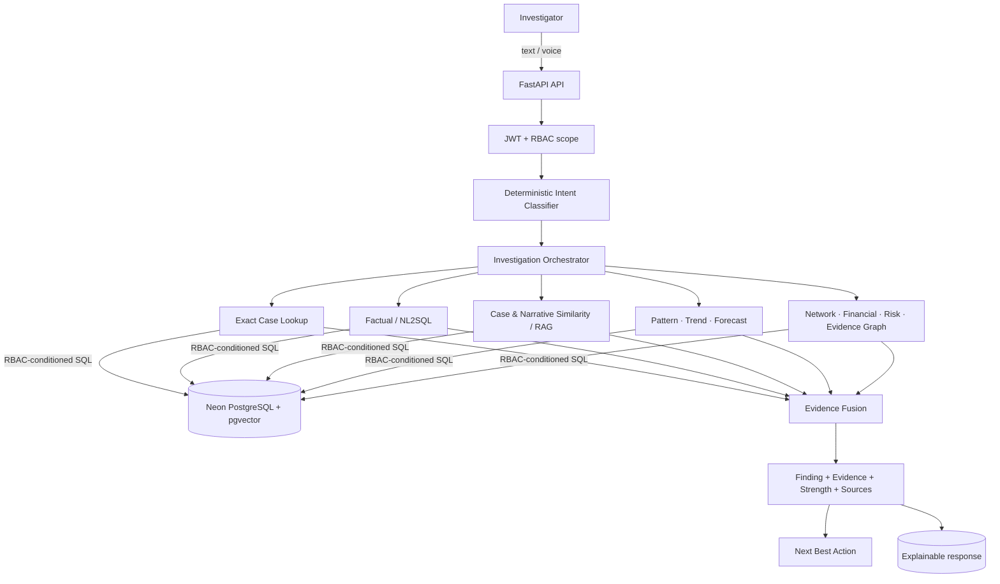

# TriNetra — Evidence-First, Multi-Engine Investigation Intelligence

> **TriNetra** is an evidence-first, multi-engine investigation intelligence platform. It converts natural-language investigative questions into **scoped, explainable, jurisdiction-aware intelligence** for law-enforcement casework — instead of dumping a dashboard at an officer and hoping they can connect the dots.

An investigative AI should not merely answer a question. It should:

1. establish the **scope** of the question,
2. select the right **analytical method**,
3. retrieve the relevant **evidence**,
4. explain **what supports the finding**, and
5. **refuse to invent or broaden** an answer when the evidence — or the officer's authorization — is insufficient.

TriNetra is built around that principle. It is **not** a crime dashboard, not a CRUD application, and not a generic RAG chatbot. It is an orchestrated set of specialized investigation engines — exact-case resolution, factual lookup, case & narrative similarity, pattern, trend, network, financial, risk, behaviour, forecast, evidence-graph and next-best-action analysis — bound together by deterministic routing, row-level jurisdiction security and evidence grounding.

---

## Table of Contents

- [The problem TriNetra solves](#the-problem-trinetra-solves)
- [Why it is different](#why-it-is-different)
- [How the system works](#how-the-system-works)
- [The investigation pipeline](#the-investigation-pipeline)
- [Deterministic intent routing](#deterministic-intent-routing)
- [Entity-first investigation & context](#entity-first-investigation--context)
- [Persistent chat history (Catalyst Data Store)](#persistent-chat-history-catalyst-data-store)
- [The scope firewall — no silent broadening](#the-scope-firewall--no-silent-broadening)
- [Jurisdiction-aware intelligence (RBAC)](#jurisdiction-aware-intelligence-rbac)
- [NL2SQL with security guardrails](#nl2sql-with-security-guardrails)
- [Exact-case & factual correctness](#exact-case--factual-correctness)
- [Evidence-first responses](#evidence-first-responses)
- [The intelligence engines](#the-intelligence-engines)
- [Narrative intelligence (RAG)](#narrative-intelligence-rag)
- [Financial intelligence](#financial-intelligence)
- [Network intelligence](#network-intelligence)
- [Pattern · Trend · Forecast](#pattern--trend--forecast)
- [Prevention alerts](#prevention-alerts)
- [Explainability](#explainability)
- [Security by design](#security-by-design)
- [Multilingual voice & translation](#multilingual-voice--translation)
- [Maps](#maps)
- [Dataset (synthetic)](#dataset-synthetic)
- [Architecture](#architecture)
- [Technology stack](#technology-stack)
- [Example investigative workflow](#example-investigative-workflow)
- [Testing & verification](#testing--verification)
- [Getting started](#getting-started)
- [Known limitations](#known-limitations)
- [Catalyst integration](#catalyst-integration)
- [Future roadmap](#future-roadmap)

---

## The problem TriNetra solves

A real investigation rarely lives in one record. It spans cases, accused persons, financial trails, phone/network relationships, modus-operandi patterns, time trends and prior risk signals. Generic tools leave that synthesis to the officer:

| Operational problem | What a typical tool does | What TriNetra does |
| --- | --- | --- |
| Information is scattered across many dimensions | Fixed dashboards and manual navigation | Natural-language questions routed to the right analytical engine |
| A question has many valid interpretations | One generic LLM prompt guesses | A deterministic classifier decides the intent first; an LLM may only fill in scope details |
| Analytics without provenance is untrustworthy | Shows a number | Shows the finding, the supporting evidence, the source engine and evidence strength |
| AI can hallucinate record facts | LLM re-synthesizes everything | Exact-case facts are returned from the verified record; prose can never overwrite them |
| Restricted jurisdictions | Frontend UI hiding | Backend row-level filters on every data surface — including RAG, similarity, network, financial and NL2SQL |
| A failed lookup broadens the search | "No results — showing everything anyway" | The **scope firewall** stops and explains instead of broadening |
| Officers lose track of a multi-step inquiry | Stateless chat | Multi-turn investigation context with per-employee isolation |

TriNetra is designed for real investigative workflows — this repository is a complete, runnable implementation over a **fully synthetic dataset** (see [Dataset](#dataset-synthetic)); it is not yet deployed in any police organization.

---

## Why it is different

| Conventional Dashboard | Generic AI Chatbot | **TriNetra** |
| --- | --- | --- |
| Fixed charts; the officer does the reasoning | One LLM prompt for every question | Deterministic **intent routing** → specialized investigation engines |
| Single analytical path per page | Generated text, no provenance | **Evidence-first** findings with evidence strength & source engines |
| No investigative memory | Stateless (or prompt-stuffed) | Context-aware **multi-turn investigation** with entity retention |
| Frontend access control | No jurisdiction concept | **Backend row-level jurisdiction enforcement** on every engine |
| Broad search when filters fail | LLM invents or broadens | **Scope firewall**: refusal or explicit limitation, never an unrestricted fallback |
| Isolated records per screen | Generic corpus answer | Cross-case, network, financial and narrative **relationships** |
| Static banners | — | **Evidence-driven prevention alerts** derived from real thresholds |

The innovation is architectural: the LLM is deliberately **not** the source of truth. Deterministic controls around the LLM — the intent classifier, the entity resolver, the RBAC scope, the SQL guardrails and the evidence fuser — decide *what* runs, *on which data*, and *what may be claimed*.

---

## How the system works

```
                 ┌─────────────────────────────────────────────┐
                 │            Investigator (web UI)            │
                 └──────────────────────┬──────────────────────┘
                                        │ text or voice (Kannada / English)
                                        ▼
                 ┌─────────────────────────────────────────────┐
                 │              FastAPI  (app.py)              │
                 │    JWT auth → RBAC scope → audit log        │
                 └──────────────────────┬──────────────────────┘
                                        ▼
                 ┌─────────────────────────────────────────────┐
                 │     Deterministic Intent Classifier         │
                 │  intent · allowed engines · needs context   │
                 └──────────────────────┬──────────────────────┘
                                        ▼
                 ┌─────────────────────────────────────────────┐
                 │        Investigation Orchestrator           │
                 │  (entity/context merge → plan → execute)    │
                 └──────┬─────────┬─────────┬──────┬───────────┘
                        ▼         ▼         ▼      ▼
              ┌────────────┐ ┌─────────┐ ┌───────┐ ┌──────────────┐
              │ Exact Case │ │ Factual │ │ Case/ │ │  NL2SQL      │
              │ Lookup     │ │ Lookup  │ │ Narr. │ │  (guarded)   │
              └────────────┘ └─────────┘ └───┬───┘ └──────────────┘
              ┌────────────┐ ┌─────────┐ ┌───▼────┐
              │ Criminal   │ │ Financial│ │ Pattern│─ RAG (vector)
              │ Network    │ │  Intel. │ │ Trend  │   embeddings
              └────────────┘ └─────────┘ └────────┘
              ┌────────────┐ ┌─────────┐ ┌────────┐
              │ Risk /     │ │ Forecast│ │Evidence│  ← every engine
              │ Behaviour  │ │ (Holt-  │ │ Graph  │    receives the
              └────────────┘ └─────────┘ └────────┘    RBAC SQL scope
                                        │
                                        ▼
                 ┌─────────────────────────────────────────────┐
                 │            Neon PostgreSQL                  │
                 │ CaseMaster · Unit · District · Accused ·    │
                 │ SuspectAccount · FinancialTransaction ·     │
                 │ CaseNarrativeEmbedding (pgvector 768-d) ·   │
                 │ OffenderRiskScore · ...                     │
                 └─────────────────────────────────────────────┘
                                        │
                                        ▼
                 ┌─────────────────────────────────────────────┐
                 │  Evidence fusion → response builder         │
                 │  finding · evidence · why it matters ·      │
                 │  strength · sources · citations             │
                 │  + reasoning trace + next actions           │
                 └─────────────────────────────────────────────┘
```



The LLM (Groq-hosted `openai/gpt-oss-120b`) writes the narrative prose and can *enrich* scope details, but it operates **inside** deterministic boundaries — it never decides the intent, never removes the RBAC condition from generated SQL, and never overwrites a verified record fact.

---

## The investigation pipeline

```
USER QUESTION
        ↓
DETERMINISTIC INTENT + ENTITY UNDERSTANDING
        ↓
JURISDICTION / RBAC SCOPE
        ↓
APPROPRIATE INVESTIGATION ENGINE(S)
        ↓
DATABASE / GRAPH / FINANCIAL / NARRATIVE EVIDENCE
        ↓
EVIDENCE FUSION
        ↓
EVIDENCE STRENGTH + UNCERTAINTY
        ↓
EXPLAINABLE INVESTIGATIVE RESPONSE
        ↓
NEXT INVESTIGATIVE ACTIONS
```

Every investigation question goes through `POST /api/chat` (or `POST /api/investigate` for the multi-engine planner). The response carries:

- the **intent detected** (`reasoning_trace` — security check, intent, execution detail);
- the resolved **case / accused / entity context** used;
- structured **case records** and **citations**;
- for multi-engine runs, a **plan**, per-phase **engine execution log**, **evidence inventory**, **findings**, graph/analytics payloads and next-action leads.

Findings are expressed as evidence-first statements: a finding, the evidence behind it, why it matters, and an **evidence-strength** classification (strong / moderate / limited). When evidence is insufficient, the system says so explicitly — it never converts "not enough evidence" into a negative verdict or a fabricated one.

---

## Deterministic intent routing

The intent policy lives in one place — `engines/intent_classifier.py` — as a **central deterministic classifier**. Its canonical catalogue:

| Intent | Meaning |
| --- | --- |
| `exact_case_lookup` | One identifier → one authoritative record |
| `case_search` | Record retrieval by filters (e.g. "latest burglary in Mysuru") |
| `case_similarity` | Find cases similar to a **specific** FIR/case |
| `narrative_similarity` | Find cases with a similar MO / narrative description |
| `pattern_detection` | Recurring patterns / common MO / clusters |
| `trend_analysis` | Time-series change (increase/decrease over months/years) |
| `criminal_network` | Who is connected / co-accused / syndicate |
| `financial_analysis` | Money trails / transactions / accounts / links |
| `behaviour_analysis` | Repeated behaviour of offenders |
| `risk_analysis` | Risk profile / re-offending likelihood |
| `forecasting` | Future-oriented prediction (next months / year) |
| `evidence_graph` | Evidence relationships / cross-case links |
| `next_best_action` | Recommended next investigative step |
| `general_investigation` | Broad, multi-engine investigation fallback |

Each intent declares the **only** engines that may answer it (`INTENT_ENGINES`). An intent never silently falls back to a different engine: if its engines cannot run — no entity, no scope — the pipeline returns **"context required" / "scope unresolved"** instead of substituting a broad case list. An LLM planner may extract districts, crime labels, time windows and entity IDs, but it **cannot override the intent/engine policy**; it only fills in parameters.

Real routing examples (all verified by the automated routing test-suite):

| Question | Routes to |
| --- | --- |
| "What is FIR `100050030202600014`?" | **exact case lookup** — the verified record |
| "Is FIR `…014` a motor vehicle theft case?" | **exact-case verification** — "No, it is a Burglary case…" — no broad MV-theft search |
| "Find cases similar to FIR `…`" | **case similarity** anchored on the resolved case identity |
| "Find cases with a similar modus operandi to a forced-entry break-in" | **narrative / MO similarity** (RAG), not factual lookup |
| "Do we have a recurring pattern of motor vehicle theft?" | **pattern detection** |
| "How has motor vehicle theft changed over the last 6 months?" | **trend analysis** (historical time window) |
| "Show the financial trail for FIR `…`" | **financial intelligence** anchored to that FIR |
| "Who is connected to FIR `…`?" | **criminal network** anchored to that FIR |
| "Is there a pattern in behaviour of repeat offenders?" | **behaviour analysis** |
| "Which offenders are at highest risk of re-offending?" | **risk analysis** |
| "What is the crime outlook for the next 6 months?" | **forecasting** (future window), not trend |
| "Show the evidence relationships for FIR `…`" | **evidence graph** |
| "Show their transaction trail" (after an FIR/network turn) | **financial analysis** inheriting the prior context |
| "Show cases of quantum levitation in Bengaluru" | **explicit scope failure** — zero broad fallback queries |

Pattern vs trend vs forecast: **pattern** asks *what recurring structure exists*, **trend** asks *how activity changed over an observed period*, and **forecast** asks *what may happen in a future window*, based only on observed history and clearly labelled as projected.

---

## Entity-first investigation & context

The classifier distinguishes entity *resolution* from entity *use*:

- "Show the financial trail for **FIR X**" resolves X, then runs **financial intelligence on that case** — never a state-wide financial sweep.
- "Find cases similar to **FIR X**" anchors the similarity engine on the resolved **CaseMasterID**.
- "Who is connected to **FIR X**?" anchors the network engine on that case's accused.
- A question that names an unknown FIR resolves to **record-not-found** — it never degrades into a general case list.

Multi-turn context (session store, isolated per employee) retains the discovered case/accused/entity set across investigative turns:

> "Show details of FIR X" → "Who is connected to it?" → "Show their transaction trail." → "Now show recent burglary cases in Mysuru."

Turns 2–3 inherit the resolved entities deterministically (a follow-up reference such as *"their"* is merged from context without relying on an LLM rewrite). Turn 4 is detected as a **new scope** and deliberately *replaces* the old context so the earlier FIR can never leak into the Mysuru query. Context is namespaced per employee, so two users can never inherit each other's sessions — even when they share the same default session token.

---

## Persistent chat history (Catalyst Data Store)

Conversations are **persistent**, not ephemeral: an investigator can close the browser, log in later, reopen a conversation and continue exactly where they left off — including the investigation context that anchors follow-up questions such as "who is connected to *it*?" and "show *their* transaction trail".

- **Storage split.** Neon PostgreSQL remains the source of truth for all investigation records (FIRs, accused, financial, network, analytics, alerts). Catalyst Data Store stores only chat artifacts in three tables: `chat_conversations`, `chat_messages` and `investigation_context`.
- **What is persisted.** Every user message and the **exact final assistant answer** returned to the frontend (deterministic exact-case facts are stored verbatim — history is a record of what was returned, never regenerated). Each message carries the resolved canonical intent and the engine(s) used (`case_query,criminal_network,financial_analysis` style). Structured investigation context (case/accused/transaction ids as JSON, resolved scope, last intent/engines) is upserted per conversation.
- **Ownership.** `chat_conversations` deliberately has no `employee_id` column in the existing schema; ownership is carried by `chat_messages.employee_id`, written only from the authenticated JWT identity. Every read/write/delete is filtered server-side by that employee id, so knowing another user's `conversation_id` yields a neutral 404. An empty conversation contains no data; its first message (written with the authenticated identity) establishes ownership.
- **No RBAC bypass.** Restored context is treated as *previous application state*, never as evidence: engines still enforce the caller's own jurisdiction filter, and a persisted entity that is no longer accessible simply resolves to nothing.
- **Failure isolation.** If the persistence tier is unavailable, `POST /api/chat` without a conversation id keeps working statelessly, and a persistence failure mid-turn is logged while the investigation answer is still returned. Conversation-scoped requests that cannot prove ownership return an honest `503` instead of running unowned.
- **Backend selection.** `CHAT_STORE_BACKEND=auto` uses the Catalyst store when configured and an in-memory fallback (logged, non-persistent) otherwise; `catalyst` and `memory` force either backend. API: `GET/POST /api/chat/conversations`, `GET/DELETE /api/chat/conversations/{id}`, plus optional `conversation_id` on `/api/chat` and `/api/investigate`. The frontend sidebar lists, reopens and deletes the employee's conversations.

---

## The scope firewall — no silent broadening

This is a defining safety property of TriNetra:

> **Failure to resolve scope results in refusal or an explicit limitation — never an unrestricted fallback.**

Implemented behaviours (all covered by tests):

- **Unknown crime** ("cases of quantum levitation…") → the factual path stops with a "could not map to a known crime category" scope failure and **zero** queries.
- **Unknown district/station** ("…in Atlantis district") → location-resolution failure, no broad query.
- **Unavailable FIR** → "couldn't find FIR/Case … in the authorized records", no substitute list.
- **Financial/network analysis with no entity and no context** ("Show their transaction trail" as a first turn) → **"Context Required"**, no entity → zero broad queries.
- **An out-of-jurisdiction anchor** (another district's FIR, accused, account, or network) → 404 / "not found in authorized records", indistinguishable from a genuinely missing record.

The only "fallback" in the system is the *intent-policy* one — `general_investigation`, which is itself a deliberate multi-engine investigation, never an implicit "return everything" query.

---

## Jurisdiction-aware intelligence (RBAC)

Roles are derived server-side from the employee's police rank (`engines/auth.py`) and enforced as SQL row-level conditions (`engines/security.py`):

| Role (derived from rank) | Default jurisdiction |
| --- | --- |
| Policymaker (DGP / ADGP / IGP / Director) | State-wide |
| Analyst (SP / DySP / Superintendent) | State-wide |
| Supervisor (Inspector / CI / Circle) | Own **district** |
| Investigator (default) | Own **police station** |
| Unrecognized role | **Deny** (`1=0`) — fail closed |

The RBAC condition is generated on the server from the JWT profile (`cm.PoliceStationID = <unit>` for investigators, `u.DistrictID = <district>` for supervisors, `1=1` for state-wide roles) and is threaded into the **data-access layer of every engine**, not just the UI. Jurisdiction-bounded surfaces include:

- case search & case detail (an out-of-scope case detail is a 404),
- all analytics endpoints (a restricted role can never widen its own district),
- **RAG / narrative retrieval** — the corpus is restricted *before* similarity ranking, so an answer can never cite an inaccessible narrative,
- case similarity and emerging patterns,
- network search / node detail / graph (anchored lookups are scope-gated),
- financial intelligence,
- risk profiles & offender analytics,
- NL2SQL (the RBAC condition must survive SQL generation — see below),
- evidence-graph label enrichment,
- prevention alerts,
- offender demographics (n<10 cells are **redacted** at the backend),
- chat export and STT/translation endpoints (JWT required).

**Indirect access is blocked, not just direct access.** A restricted user cannot reach another jurisdiction's data by going "around" the case screen through RAG similarity, case similarity, graph expansion, network lookup, financial lookup, NL2SQL, or a crafted evidence-graph finding. Account numbers are masked at the backend boundary (e.g. `AC••••1234`) — never relied on the frontend to hide them.

Every chat/investigation interaction is written to the **audit log** (`QueryAuditLog`) with the authenticated employee ID, role, query, resolved engine, resolved SQL and row count.

---

## NL2SQL with security guardrails

NL2SQL is not "LLM writes SQL and we run it". `engines/nl2sql.py` applies a staged security layer before anything touches the database:

1. **SELECT-only** — non-`SELECT` statements are rejected.
2. **Multi-statement rejection** — any extra `;` or second `SELECT` is refused.
3. **RBAC-condition verification** — for restricted roles, the generated SQL must *literally contain* the server-side jurisdiction condition. If the LLM dropped it, the system regenerates the SQL with the error injected; if the regenerated SQL still lacks the condition, it **refuses** — it never executes a scope-less query.
4. **Table whitelist** — only approved tables (`casemaster`, `unit`, `district`, `casestatusmaster`, `casecategory`, `gravityoffence`, `court`, `crimesubhead`, `crimehead`, `accused`, `offenderriskscore`) may appear in `FROM`/`JOIN`.
5. **Schema-aware generation** — the schema map documents the real tables and join paths, so the model stops inventing fictional tables.
6. **LIMIT protection** — result sets are capped unless the query already bounds them.
7. Only then is the SQL executed and its results returned with `executed_sql` for audit.

Date/time correctness is handled deterministically where it matters: "How many cases were registered in 2025?" produces a real `2025-01-01 → 2025-12-31` window (verified: 208 cases in Bengaluru Urban for 2025, not 577 all-time).

---

## Exact-case & factual correctness

Exact-case questions follow a **deterministic path** (`engines/exact_case.py`, `engines/factual_lookup.py`) that reads the verified record directly:

- FIR/Crime number, crime sub-head, registration date, district, police station, case status — returned **from the record**, verbatim-faithful;
- an LLM never re-synthesizes or "improves" these fields, so it cannot hallucinate a status, date, station, or crime category;
- verification questions ("is FIR X a vehicle theft case?") are answered against the record and do not open a category-wide search;
- count/recency questions resolve districts, crime sub-heads, statuses and calendar-year windows deterministically and surface exact counts with the scope used.

The same module refuses to guess: unknown locations, unresolved crime labels and empty result sets produce explicit scope-failed / no-records responses.

---

## Evidence-first responses

Every investigation conclusion is grounded:

```
FINDING        — what the engines concluded
EVIDENCE       — the records / signals behind it (case IDs, counts, links)
WHY IT MATTERS — operational implication
STRENGTH       — strong / moderate / limited, derived from evidence volume
SOURCES        — the engine(s) that produced it, plus citations
```

The platform distinguishes "**no evidence found**" from "**not investigated**", refuses to assert mastermind/causal claims without evidence, and marks projected outputs (forecasts) as projections. Each chat response also carries a **reasoning trace** (security check → intent → execution detail) so an officer can see *how the system got this answer*.

---

## The intelligence engines

All engines live in `trinetra-backend/engines/`. Each accepts the caller's RBAC SQL condition and executes against Neon PostgreSQL.

| Engine | Module | What it does |
| --- | --- | --- |
| Exact case lookup | `exact_case.py` | One identifier → authoritative, verified record (with accused, status, scope checks) |
| Factual case lookup | `factual_lookup.py`, `case_explorer.py` | Deterministic record search: district/unit, crime sub-head, status, calendar windows, recency limits; location & crime resolution |
| Case similarity | `pattern_engine.py` | Similar cases to an **authorized anchor** via pgvector narrative semantics, MO overlap, spatio-temporal proximity; ranked with reasons |
| Narrative similarity / RAG | `rag.py` | MO/narrative description → vector retrieval over the jurisdiction-filtered corpus → cited summary |
| Emerging patterns | `pattern_engine.py` | Recurring crime sub-head / MO clusters inside the caller's jurisdiction |
| Trend analysis | `analytics.py` (+ guarded NL2SQL) | Historical monthly time-series, YoY/category comparisons |
| Criminal network | `network_engine.py`, `graph.py` | N-hop graph from an **authorized accused anchor**: co-accused, financial, same-person, shared-MO and victim↔accused links with community detection |
| Financial intelligence | `financial_intelligence.py` | Case/accused-linked account & transaction trails, cross-case links, transaction chains, deterministic anomaly signals, account masking, lead generation |
| Risk profiling | `analytics.py` (precomputed `OffenderRiskScore`) | Risk score 0–100, repeat-offender flag, contributing factors, computed-date provenance |
| Behaviour analysis | routed to pattern/risk engines | Repeated offender behaviour patterns over cases |
| Forecasting | `forecasting.py` | **Holt-Winters triple exponential smoothing** on monthly case-category counts with prediction intervals and signal extraction |
| Predictive hotspots | `predictive_hotspots.py` | Geographic classification (historical / emerging / predicted) |
| Evidence graph | `evidence_graph.py` | Renders findings as entity–relationship graphs (case similarity, pattern membership, network edges, risk links) with label provenance — label lookups jurisdiction-scoped |
| Next best action | `next_best_action.py` | Evidence-grounded investigative leads traceable to records/engine outputs |
| NL2SQL | `nl2sql.py` | Guarded natural-language → SQL for open-ended factual & analytical questions |
| Prevention alerts | `prevention_alerts.py` | Evidence-driven early-warning detector (below) |

The **investigation orchestrator** (`investigation.py`) merges conversation context, plans across the allowed engines for the detected intent, executes phases, fuses the per-phase evidence into findings, and composes the response plus next actions.

---

## Narrative intelligence (RAG)

Narrative/MO questions embed the query with Google **Gemini (`gemini-embedding-001`, 768-dim)**, then run a pgvector **cosine search** (`<=>`) over the `CaseNarrativeEmbedding` corpus joined to `CaseMaster → Unit → District`. Two properties matter:

- **Jurisdiction filtering happens inside the SQL, before ranking** — the candidate set is restricted to the caller's RBAC scope (plus any explicit district) so retrieval itself cannot touch another jurisdiction's narratives.
- The retrieved top-3 narratives are given to Groq (`openai/gpt-oss-120b`, temperature 0) with an instruction to answer **only** from the supplied ground-truth FIR context and to cite CrimeNos; the answer returns with those citations.

Narrative similarity is deliberately separate from structured case similarity: one compares *descriptions of behaviour*, the other compares *known records* to an anchor case. Retrieval accuracy is not claimed to be perfect — the system returns what the vector search finds inside the authorized corpus and says so when nothing matches.

---

## Financial intelligence

`engines/financial_intelligence.py` analyzes transactions of accounts linked to an authorized case/accused:

- **transaction trails** per account and across accounts,
- **cross-case links** (an account or person appearing in more than one case),
- **shared accounts** across accused,
- **transaction chains** (multi-hop money movement),
- **deterministic anomaly signals** — high-volume accounts, high-value transactions versus median, rapid movement within a short window, bidirectional transfers between the same pair, and cross-case activity — each with a plain-language reason derived from the numbers,
- **financial lead generation** with evidence signals and recommended actions.

All analysis is bounded by the RBAC scope of the anchor case; an unscoped financial request from a restricted role returns a context/scope failure rather than every account in the database. Raw account numbers are **masked at the backend boundary** (never surfaced in API payloads). The engine reports what the data shows — it does not claim to detect laundering or fraud schemes beyond the signal definitions above.

---

## Network intelligence

`engines/network_engine.py` builds an N-hop criminal network from an **authorized anchor accused** with five relationship layers:

| Layer | Meaning |
| --- | --- |
| `co_accused` | Shared case membership |
| `financial` | Linked through suspect accounts / money movement |
| `repeat_identity` | Same person appearing across cases |
| `shared_mo` | Same modus-operandi pattern |
| `victim_accused` | Victim ↔ accused crossover |

Expansion is anchored and hop-limited (1–3 hops) with community detection and per-edge provenance (which case produced the link). Search and node detail endpoints are jurisdiction-gated; cross-district nodes only appear when they are legitimately reachable from an authorized anchor — the endpoint is not an unrestricted person-search.

---

## Pattern · Trend · Forecast

- **Pattern detection** looks for recurring crime sub-heads / MO tags in the current data and reports *honest* zero-result states with the records examined.
- **Trend analysis** aggregates real monthly case counts over the requested historical window (e.g. "over the last 6 months") and separates observed evidence from projections.
- **Forecasting** (only for genuinely future-oriented questions: "next 6 months", "outlook", "next year") runs **Holt-Winters triple exponential smoothing** on monthly counts at **case-category granularity**, reports prediction intervals and labels the output as a projection — it never presents forecasts as fact, and it does not make unsupported sub-head-level predictions.

---

## Prevention alerts

`engines/prevention_alerts.py` is a deterministic, evidence-driven early-warning detector — **not** a hardcoded banner feed:

- windows are anchored to the newest record actually present in the caller's jurisdiction;
- alerts fire only when measurable conditions hold, e.g. a crime sub-head's recent 30-day count is ≥ 1.8× its prior-window baseline (with a minimum recent-case floor), geographic station clusters, repeated MO tags (≥3 cases), and forecast signals;
- every alert carries the affected **crime category**, **location**, **time window**, **recent vs baseline counts**, **supporting case records**, stations affected and **recommended preventive actions**;
- if the data does not satisfy any rule, the API returns an **honest "no active alerts"** state with the analysed period, windows and case counts — no evidence, no fabricated alert;
- jurisdiction comes from the authenticated profile (state-wide analyst sees all, a station investigator only their own station).

---

## Explainability

Every answer attempts to expose the investigative path:

```
Question → Scope → Engine → Evidence → Finding
```

The chat UI (Ask TriNetra) shows the *investigation scope* (location, crime, period, records found, access), case record cards with citations, structured findings with evidence strength, graph/analytics panels where relevant, a reasoning trace, and **next-best-action leads**. Investigation sessions can be exported as a formatted HTML report (`/api/chat/export`, JWT-protected). Generic chatbots show generated text; TriNetra shows *why the answer exists* and *what supports it*.

---

## Security by design

Implemented, code-verified protections:

- **JWT authentication** (HS256, 24 h expiry) on every data endpoint; profile-derived role/scope, never client-supplied.
- **RBAC with row-level SQL enforcement** (`build_rbac_filter`) — see [Jurisdiction-aware intelligence](#jurisdiction-aware-intelligence-rbac).
- **Server-side scope resolution** — a requested district can never widen a restricted role's scope.
- **Session isolation** — investigation context namespaced per employee.
- **Sensitive-data masking** at the backend (account numbers).
- **SQL guardrails** — SELECT-only, no multi-statement, whitelisted tables, RBAC-condition verification, regeneration-or-refusal, LIMIT cap.
- **Scope firewall** — no unrestricted fallback on unresolved scope (see above).
- **Audit logging** of queries with authenticated identity.
- **Demographics redaction** — cells with n<10 are returned as `Redacted (n<10)`.
- **Evidence-graph label scoping** — ID→name enrichment honors jurisdiction, so a crafted finding cannot enumerate other districts' CrimeNos or accused names.
- **RAG retrieval scoping** — jurisdiction applied before similarity ranking.

Two operational notes: JWT signing reads `JWT_SECRET` from the environment (a dev fallback secret exists in code — set a strong `JWT_SECRET` for any deployment), and the JWT/API key secrets must never be committed (the repo's `.env` files are git-ignored).

---

## Multilingual voice & translation

`engines/sarvam_engine.py` integrates **Sarvam AI** (API key via environment):

- **Speech-to-text** (`saaras:v3`) with `kn-IN` (Kannada), `en-IN` (English), and other supported language codes — an investigator can dictate a query in Kannada or English;
- **Translation** (`sarvam-translate:v1`) so a Kannada voice query is translated to English before routing and the response can be toggled back (`/api/sarvam/stt`, `/api/sarvam/translate`, both JWT-protected).
- **Text-to-speech** (`bulbul:v3`) returning base64 WAV audio (`/api/sarvam/tts`, JWT-protected) for spoken answers.

The chat page exposes a microphone button and an English ⇄ ಕನ್ನಡ toggle; the transcribed/translated text flows through the *same* deterministic routing described above.

**TriNetra Voice Copilot** (new): a floating, draggable, voice-first assistant mounted in the authenticated shell (`src/components/voice/`). It speaks the welcome prompt, listens on click (no continuous mic), transcribes through the Sarvam STT above, sends the text through the *existing* `/api/chat` or `/api/investigate` pipeline with the same shared `conversation_id`/investigation context as AskTriNetra, speaks a concise, deterministic, evidence-grounded answer via Sarvam TTS (English or Kannada), and offers strictly whitelisted screen-action buttons (e.g. open Network Analysis, Financial Trail). Voice is an interface only — it never bypasses intent routing, RBAC, or the scope firewall, and it creates no second AI pipeline. Its position is stored locally (`localStorage`), never in the database.

---

## Maps

- Crime analytics, pattern analytics and forecast maps render with **Leaflet + OpenStreetMap tiles** — keyless, with proper attribution.
- The case-detail drawer's location mini-map uses **Google Static Maps**, driven by the environment variable `VITE_GOOGLE_MAPS_API_KEY` (see `trinetra-client/.env.example`). No key is hardcoded; when the key is unset the UI shows a graceful placeholder and the GPS coordinates remain available.

---

## Dataset (synthetic)

> **This repository uses a fully synthetic dataset for development, demo and testing.** The records are generated crime data with seeded investigative storylines (gangs, MO rings, financial trails) — they are **not** real police records.

Verified contents of the seeded Neon database:

- **2,896** FIR / case records
- **31** districts, **126** police stations
- **3,827** accused
- **58** financial transactions and **25** suspect accounts (storyline-linked)
- records spanning **January 2024 – July 2026**
- precomputed `OffenderRiskScore` rows and a `CaseNarrativeEmbedding` vector corpus

Schema notes: police stations are modeled as `Unit` rows (typeid 1) under `District`; `CaseMaster` links to `Unit`, `CaseStatusMaster`, `CrimeSubHead`/`CrimeHead` and `GravityOffence`; accused link to cases via `Accused.CaseMasterID`; financial data via `SuspectAccount` and `FinancialTransaction`.

---

## Architecture

See [How the system works](#how-the-system-works) for the full diagram. In one sentence: a **React + TypeScript** client talks to a **FastAPI** backend which authenticates the officer, computes their RBAC SQL scope, classifies intent deterministically, and executes one or more of the specialized engines — each bounded by that scope — before fusing evidence into an explainable response. LLMs are embedded (Groq for generation/synthesis, Gemini for narrative embeddings, Sarvam for speech/translation) but always behind deterministic policy layers.

---

## Technology stack

| Layer | Technology (verified in repo) |
| --- | --- |
| Frontend | React, TypeScript, Vite, Tailwind CSS v4 |
| UI libraries | react-router-dom, lucide-react icons |
| Charts / maps / graphs | Recharts, Leaflet + react-leaflet, React Flow (reactflow) |
| API client | fetch-based `src/services/api.ts` → `http://127.0.0.1:9000` |
| Backend | Python 3.11, FastAPI, Uvicorn, Pydantic |
| Data | Neon PostgreSQL (`NEON_DATABASE_URL`), psycopg2 |
| Vectors | pgvector (`CaseNarrativeEmbedding`, 768-dim embeddings) |
| LLM | Groq `openai/gpt-oss-120b` (routing, synthesis, NL2SQL), Google Gemini `gemini-embedding-001` (embeddings) |
| Speech/translation | Sarvam AI `saaras:v3` (STT), `sarvam-translate:v1`, `bulbul:v3` (TTS) |
| Chat history | Zoho Catalyst Data Store (`zcatalyst-sdk` Python) — conversations/messages/context |
| Auth | JWT (HS256), rank-derived RBAC |
| Graphs | NetworkX (backend), React Flow (frontend) |
| Other | numpy, pandas, python-multipart, requests |

Environment variables: backend `.env` (template in `trinetra-backend/.env.example`) — `NEON_DATABASE_URL`, `GROQ_API_KEY`, `GEMINI_API_KEY`, `SARVAM_API_KEY`, `JWT_SECRET`, `CHAT_STORE_BACKEND`, and (for Catalyst-backed chat persistence outside AppSail) `CATALYST_AUTH` + `CATALYST_OPTIONS`; client `.env` — `VITE_GOOGLE_MAPS_API_KEY` (optional). Real `.env` files are git-ignored.

---

## Example investigative workflow

1. **"Show me the details of FIR 100050030202600014."** → Exact-case engine returns the verified record: Burglary, registered 2026-07-10, Bengaluru Urban, station + status — deterministic, no LLM rewrite of facts.
2. **"Who is connected to it?"** → Follow-up reference resolved to the case context; the criminal-network engine expands the authorized anchor (co-accused, shared MO, financial links, victim/accused crossover).
3. **"Show their transaction trail."** → Financial intelligence analyzes accounts of the discovered entities — masked account numbers, trails, cross-case links and deterministic anomaly signals.
4. The response fuses these into findings with evidence strength, source engines, citations and next-best-action leads.
5. **"Now show recent burglary cases in Mysuru."** → Detected as a *new scope*; the previous FIR context is replaced, and the query runs scoped to Mysuru without leakage from earlier turns.

---

## Testing & verification

Current verified state (run on this branch, live Neon DB):

- **Backend:** `185 passed, 2 skipped, 9 environment-limited` across the full `Testing/` suite (`python -m pytest Testing/…`).
- **Frontend:** `tsc -b` — **0 errors**; Vite production build — **successful**.
- **Compile:** `py_compile` over `app.py` + all engines — clean.

The suite covers jurisdiction isolation (RAG, narrative similarity, patterns, exact case, network, financial, risk and evidence-graph probes with cross-district assertions), endpoint security (no/invalid token → 401; role-scope checks), intent routing (65 routing tests), exact-case correctness, NL2SQL guardrails (refusal paths), session isolation, financial/network masking, prevention alerts, persistent chat conversations (lifecycle, cross-user isolation, context restoration after reload, new-scope replacement, Catalyst-failure survival), and a runtime-verified NL2SQL accuracy benchmark against DB ground truth.

The **9 environment-limited failures** are Groq daily token-quota rejections (HTTP 429 `rate_limit_exceeded`) hit while the LLM-dependent HTTP guardrail benchmark ran after the rest of the suite had consumed the day's budget — same code path passes when quota is available; they are not code failures. Rerun `python -m pytest Testing/test_security_guardrails.py -q` once the quota resets.

The **two skips** are environment guards, reported honestly:

1. `Testing/test_rag_ragas.py` — the optional RAGAS quality harness needs extra dependencies (`ragas`, `datasets`) and a judge-LLM configuration; it skips cleanly when they are absent.
2. One guardrail test in `Testing/test_security_guardrails.py` requires a provisioned read-only database role via `READONLY_DB_URL`.

---

## Getting started

### Prerequisites

- Python 3.11 (developed and tested on 3.11.9), Node.js (npm)
- A Neon PostgreSQL database (or any PostgreSQL with pgvector)
- API keys: Groq (`GROQ_API_KEY`), Google Gemini (`GEMINI_API_KEY`), optional Sarvam (`SARVAM_API_KEY`)

### Backend

```bash
cd trinetra-backend
python -m venv .venv && source .venv/bin/activate      # Windows: .venv\Scripts\activate
python -m pip install -r requirements.txt              # pins may need resolving on your Python version
# Create a .env file from the template (git-ignored):
cp .env.example .env        # then fill in NEON_DATABASE_URL, GROQ_API_KEY, JWT_SECRET, ...
uvicorn app:app --host 0.0.0.0 --port 9000

# Optional — persistent chat history via Catalyst Data Store (outside AppSail):
#   export CHAT_STORE_BACKEND=catalyst
#   export CATALYST_OPTIONS='{"project_id": ..., "project_key": ..., "project_domain": ...}'
#   export CATALYST_AUTH='{"refresh_token": ...}'   # service-account credential JSON
```

(The live demo database is seeded; schema/seed scripts and CSV dumps are documented under `Catalyst_Schema_CSVs/` and the repository's documentation folders.)

### Frontend

```bash
cd trinetra-client
npm install
npm run dev          # http://localhost:5173 — the API client targets http://127.0.0.1:9000
```

Log in with a seeded employee (e.g. `employee_id: 96`, password `1234` for state-wide access).

### Checks

```bash
cd trinetra-backend
python -m py_compile app.py engines/*.py
python -m pytest Testing/test_endpoint_security.py Testing/test_jurisdiction_isolation.py -q

cd trinetra-client
npx tsc -b
npm run build
```

---

## Known limitations

- **Optional harnesses** — RAGAS evaluation and the read-only-role guardrail require extra dependencies/environment (see [Testing](#testing--verification)).
- **Google Static Map preview** requires an operator-supplied `VITE_GOOGLE_MAPS_API_KEY`; without it a placeholder is shown (coordinates always available).
- **Forecast granularity** is at case-category level (monthly counts); sub-head-level projections are not made.
- **Network expansion** from an authorized anchor may legitimately traverse cross-district relationships where the graph supports them (by design — reachability, not open search).
- **LLM-synthesized prose** for analytical responses depends on the configured LLM; deterministic record facts (exact case, counts, scope) are protected from LLM overwrite.
- **JWT dev fallback** — sign tokens with an explicit strong `JWT_SECRET` outside development.
- **Catalyst Data Store is used for chat persistence only.** Without `CATALYST_AUTH`/`CATALYST_OPTIONS` (or an AppSail runtime) the chat store falls back to a logged, in-memory backend — the UI works but history does not survive a restart. All other Catalyst services remain planned (see below).
- The demo database is **synthetic**; no production police data is present.

---

## Catalyst integration

Catalyst is **partially integrated, exactly as follows — no more**:

**Implemented today:** persistent chat history on **Catalyst Data Store** using the official `zcatalyst-sdk` Python SDK (`engines/catalyst_chat_store.py`). Three manually-created tables store conversations (`chat_conversations`), messages (`chat_messages`) and per-conversation investigation context (`investigation_context`). The SDK is initialized lazily from `CATALYST_AUTH` + `CATALYST_OPTIONS` for non-AppSail runs, or from the request context when deployed on Catalyst AppSail. Ownership is enforced server-side through `chat_messages.employee_id` (see [Persistent chat history](#persistent-chat-history-catalyst-data-store)). **Neon PostgreSQL remains the investigation database of record** — no investigation records are stored in Catalyst.

**Not implemented / not deployed:** there is no AppSail hosting configuration in this repository, no Catalyst-based authentication, no Catalyst-hosted UI, and no Catalyst-backed investigation database or analytics. The offline CSV-backed `HybridDataEngine` design comment in `engines/database.py` is unchanged and is not in use.

**Planned / future:** AppSail for compute hosting, Catalyst Functions for event-driven pipelines, Catalyst authentication/identity where appropriate, Catalyst Cloud Scale/caching, and Catalyst AI/analytics services — integration targets, not live services.

---

## Future roadmap

Clearly separated from today's implementation:

- **Catalyst hosting & managed services (planned):** AppSail deployment of the backend (the chat-persistence layer already supports the AppSail credential context), Catalyst Functions, Cloud Scale, auth/identity and AI/analytics services — all still labelled **PLANNED**. Catalyst Data Store is already live for chat persistence; moving investigation data to Catalyst is intentionally not planned (Neon stays the record of truth).
- **Richer narrative corpus & retrieval evaluation:** run the RAGAS harness over a larger seeded narrative set to report grounded quality metrics.
- **Deployment hardening:** proper `JWT_SECRET` management, a provisioned read-only DB role for guardrail tests, TLS and deployment pipeline.
- **Investigation breadth:** deeper per-sub-head analytics, more network layers, and integration pilots with real (non-synthetic) police data under strict governance.

Nothing in this section is implemented yet; the roadmap reflects the project's documented direction.

---

## License & origin

TriNetra is a project developed for the **Karnataka Police Datathon** ("TriNetra" — three-eyed vision). All data in the repository is synthetic and generated for the competition; all claims above are grounded in the current source code and its passing verification suite.
